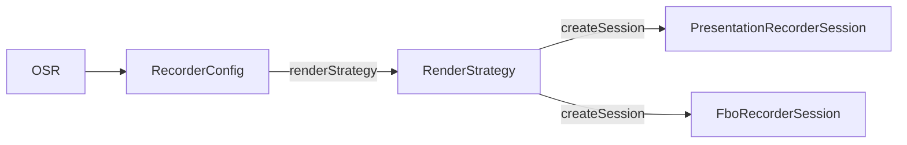

下面是**更新后的完整方案文档**。
核心变化：

* **统一入口与策略模式**：入口为 `OSR.recorder(context) { }`，通过 `presentation { }` 或 `fbo { }` 选择渲染策略，Session 由策略内部创建并注入到
  UI（FBO 策略下通过 `source { session -> }`）。
* **Session 移入 `source{}` 作用域**（FBO 策略）
* UI 在创建时即可拿到 **Session**
* UI 内部直接控制 **startRecord / stopRecord**
* **FBO 策略下**不使用 Presentation、不使用 MediaProjection
* 支持 **View / MapView**
* 支持 **Filter 扩展（示例：水波滤镜）**
* 架构符合 **SOLID + Clean Architecture**，采用 **策略模式**（RenderStrategy）与公共层 + 实现层分离
* 并发模型 **Kotlin 协程**

**文档定位**：本文档描述 **FBO 渲染策略** 的详细设计。库同时支持 **Presentation 策略**（已实现，见 IMPLEMENTATION_SUMMARY），两者均实现
`RenderStrategy`，由扩展函数注入 `RecorderConfig`。

本文档用于 **指导大模型生成代码**。

---

# Offscreen Recorder Library 设计方案

---

# 一、设计目标

实现一个 **Android 离屏视频录制库**。

核心目标：

支持画面来源：

```
普通 View
MapView
OpenGL Renderer（可扩展）
```

支持 GPU 滤镜：

```
Filter Pipeline
```

支持 UI 控制录制生命周期：

```
Session
```

支持事件监听：

```
录制开始
帧渲染
录制结束
错误
```

系统要求：

```
高性能
无系统权限
结构清晰
可扩展
```

---

# 二、关键技术约束

FBO 策略下必须满足：

* 不使用 **MediaProjection**
* 不使用 **Presentation / VirtualDisplay**

视频由 **GPU 离屏渲染** 生成（View/MapView → 纹理 → FBO → 编码）。

---

# 三、策略模式架构

库采用 **策略模式**：公共层只依赖 `RenderStrategy` 接口，不依赖具体渲染实现；Presentation 与 FBO 各自实现该接口，通过扩展函数注入配置。

**入口**：`OSR.recorder(context) { block }` 或 `OSR.recorder(context, config)`。`block` 内配置 `video {}`、`audio {}`、`output {}`、
`listener {}`，以及 **必须二选一** 的渲染策略：`presentation { display, session -> }` 或 `fbo { }`。

**流程**：配置完成后，OSR 校验 `RecorderConfig`（含 `renderStrategy != null`），然后调用
`config.renderStrategy!!.createSession(context, config)` 得到 `RecorderSession`。调用方在协程中拿到已准备好的 Session（FBO 策略下 Session
会注入到 `fbo { source { session -> } }` 的 lambda 中供 View/MapView 使用）。

**RenderStrategy 接口**（见 `osp.osr.render.RenderStrategy`）：

```kotlin
interface RenderStrategy {
    suspend fun createSession(context: Context, config: RecorderConfig): RecorderSession
}
```

Presentation 与 FBO 各自实现该接口；通过 `RecorderConfig.presentation { }` / `RecorderConfig.fbo { }` 扩展函数注入，公共层不依赖 pres 或
fbo 包。

架构关系：



---

# 四、整体架构

**FBO 渲染管线**（本策略内部）：

```
FrameSource
     │
     ▼
FrameRenderer
     │
     ▼
FilterPipeline
     │
     ▼
FBO
     │
     ▼
EncoderSurface
     │
     ▼
MediaCodec
     │
     ▼
MP4
```

**模块分层**：公共层（api、session 接口、config、render 接口、core）由 OSR 与 Presentation 策略共用；FBO 策略实现层（fbo 包）包含
source、renderer、filter 等，复用 core 的 encoder/muxer。详见第二十一节。

---

# 五、Session 设计

Session 控制录制生命周期，与公共层接口一致（见 `osp.osr.RecorderSession`）。FBO 策略下由 `FboRecorderSession` 实现，在 `createSession` 时根据
`fbo { source { session -> } }` 将 session 注入给 View/MapView。

接口：

```kotlin
interface RecorderSession {

    fun startRecord()

    fun stopRecord()

    fun release()

    fun getState(): RecorderState

}
```

状态枚举 `RecorderState`（见 `osp.osr.model.RecorderState`）：`IDLE`、`PREPARED`、`RECORDING`、`STOPPING`、`RELEASED`。

Session 特点：

```
线程安全
UI可直接调用
内部状态机控制
```

---

# 六、使用方式设计

## 统一入口 OSR + DSL

入口为 **OSR**：`OSR.recorder(context) { }`（suspend，需在协程作用域调用，如 `lifecycleScope.launch { }`）。配置项与公共层 `RecorderConfig`
一致：`video { }`、`audio { }`、`output { }`、`listener { }`，以及渲染策略。FBO 路径使用 `fbo { }`，其内可写 `source { session -> }`、
`filters { }` 等。

核心 API 示例：

```kotlin
lifecycleScope.launch {

    val session = OSR.recorder(context) {

        video {
            width = 1080
            height = 1920
            fps = 30
            bitrate = 8_000_000
        }
        output { file = File("/sdcard/demo.mp4") }
        audio { file = File("/sdcard/demo.aac") }  // 可选
        listener { onStart = { }; onSaved = { file -> } }

        fbo {
            source { s ->
                view { AnimView(context, s) }
            }
            filters { add(WaveFilter()) }
        }

    }
    // session 已 prepare 完成，可由 UI 调用 startRecord() / stopRecord()
}
```

FBO 策略下 `createSession` 内部完成 prepare，调用方拿到的即是已准备好的 `RecorderSession`（与 Presentation 策略一致）。也可使用 Builder：
`RecorderConfig.Builder().setVideoSize(1080, 1920).setOutputFile(...).setRenderStrategy(FboStrategy(...)).build()`，再
`OSR.recorder(context, config)`。

---

# 七、View 使用方式

UI 创建时直接拿到 Session（由 FBO 策略在 `source { session -> }` 中注入），接口为 `startRecord()`、`stopRecord()`、`release()`、`getState()`。

示例：

```kotlin
class AnimView(
    context: Context,
    private val session: RecorderSession
) : View(context) {

    private val paint = Paint()
    var radius = 50f

    override fun onDraw(canvas: Canvas) {
        canvas.drawCircle(200f, 200f, radius, paint)
    }

    fun startAnimation() {
        session.startRecord()
        ValueAnimator.ofFloat(50f, 200f).apply {
            duration = 2000
            addUpdateListener {
                radius = it.animatedValue as Float
                invalidate()
            }
            doOnEnd { session.stopRecord() }
        }.start()
    }
}
```

使用（在 `fbo { }` 内通过 `source { session -> }` 注入）：

```kotlin
fbo {
    source { session ->
        view { AnimView(context, session) }
    }
}
```

---

# 八、MapView 使用方式

例如使用 AMap Android SDK。Session 方法统一为 `startRecord()`、`stopRecord()` 等。

示例：

```kotlin
class MapController(
    val mapView: MapView,
    val session: RecorderSession
) {
    fun startRouteDemo() {
        session.startRecord()
        playRoute()
    }
    fun endRouteDemo() {
        session.stopRecord()
    }
}
```

Recorder（在 `fbo { }` 内）：

```kotlin
fbo {
    source { session ->
        map {
            MapController(mapView, session)
            mapView
        }
    }
}
```

---

# 九、Source 设计

Source 是 UI 输入入口，由 FBO 策略的 Session（FboRecorderSession）与 `source { }` 配置协作创建。

接口：

```kotlin
interface FrameSource {

    suspend fun attach(renderer: FrameRenderer)

    suspend fun detach()

}
```

实现：

```
ViewSource
MapSource
GLRendererSource
```

---

# 十、ViewSource 实现

由 FboRecorderSession 根据 `fbo { source { view { } } }` 配置创建。原理：

```
View.draw(Canvas)
```

流程：

```
View
 ↓
Canvas
 ↓
Bitmap
 ↓
Texture
 ↓
FBO
```

实现：

```kotlin
class ViewSource(
    private val view: View
) : FrameSource {

    override suspend fun attach(renderer: FrameRenderer) {

        renderer.setView(view)

    }

}
```

---

# 十一、MapSource 实现

由 FboRecorderSession 根据 `fbo { source { map { } } }` 配置创建。MapView 底层：

```
TextureView
OpenGL
```

流程：

```
MapView
 ↓
SurfaceTexture
 ↓
Texture
 ↓
FBO
```

实现：

```kotlin
class MapSource(
    val mapView: MapView
) : FrameSource {

    override suspend fun attach(renderer: FrameRenderer) {

        renderer.setMap(mapView)

    }

}
```

---

# 十二、Renderer 设计

由 FboRecorderSession 编排，负责：

```
获取画面
执行滤镜
输出到 FBO
```

接口：

```kotlin
interface FrameRenderer {

    suspend fun renderFrame(timeNs: Long)

}
```

实现：

```
ViewRenderer
TextureRenderer
GLRenderer
```

---

# 十三、Filter 系统

Filter Pipeline：

```
InputTexture
   ↓
Filter1
   ↓
Filter2
   ↓
Filter3
   ↓
OutputTexture
```

Filter 接口：

```kotlin
interface Filter {

    fun init()

    fun apply(
        inputTexture: Int,
        frameBuffer: Int
    ): Int

    fun release()

}
```

---

# 十四、水波滤镜示例

滤镜：

```
WaveFilter
```

实现：

```kotlin
class WaveFilter : Filter {

    override fun init() {}

    override fun apply(
        inputTexture: Int,
        frameBuffer: Int
    ): Int {

        // shader处理

        return inputTexture

    }

    override fun release() {}

}
```

Fragment Shader 示例：

```
uv.y += sin(uv.x * 20.0 + time) * 0.02
```

效果：

```
水波动画
```

---

# 十五、FilterPipeline

实现：

```kotlin
class FilterPipeline {

    private val filters = mutableListOf<Filter>()

    fun add(filter: Filter) {

        filters.add(filter)

    }

    fun render(texture: Int): Int {

        var current = texture

        filters.forEach {

            current = it.apply(current, fbo)

        }

        return current

    }

}
```

---

# 十六、Encoder 模块

FBO 策略复用公共层 core 的 MediaCodec 与 Muxer（EncoderController、MuxerController）。编码基于：

```
MediaCodec
```

流程：

```
FBO
 ↓
EncoderSurface
 ↓
MediaCodec
 ↓
Muxer
 ↓
MP4
```

核心组件：

```
VideoEncoder
MuxerController
```

---

# 十七、协程架构

所有并发使用协程。

Dispatcher：

```
MainDispatcher
RenderDispatcher
EncodeDispatcher
IODispatcher
```

结构：

```
RecorderScope
    │
    ├─ RenderLoop
    ├─ EncodeLoop
    └─ EventLoop
```

RenderLoop：

```kotlin
while (recording) {

    renderer.renderFrame(time)

}
```

---

# 十八、事件监听系统

与公共层 `ListenerConfig` 一致（见 `osp.osr.listener.ListenerConfig`），按需赋值回调。

DSL：

```kotlin
listener {
    onStart = { }
    onStop = { }
    onSaved = { file -> }
    onError = { e -> }
}
```

---

# 十九、配置系统

统一配置为公共层 `RecorderConfig`（见 `osp.osr.dsl.RecorderConfig`），含 `videoConfig`、`audioConfig`、`outputConfig`、`listenerConfig`
及由扩展函数注入的 `renderStrategy`。FBO 策略在 `fbo { }` 块内可扩展 source、filters 等。子配置包括 `VideoConfig`、`AudioConfig`、
`OutputConfig` 等。

示例：

```kotlin
// VideoConfig 在 RecorderConfig 内
video { width = 1080; height = 1920; fps = 30; bitrate = 4_000_000 }
```

---

# 二十、状态机

状态与 `RecorderState` 一致：`IDLE`、`PREPARED`、`RECORDING`、`STOPPING`、`RELEASED`。FboRecorderSession 内部用状态机（如 `AtomicReference` +
CAS）控制转换。

保证：

```
线程安全
状态合法
```

---

# 二十一、模块结构

**公共层**（与 Presentation 策略共用）：

```
osp.osr
 ├─ api          (OSR 入口)
 ├─ session      (RecorderSession 接口)
 ├─ config       (RecorderConfig、VideoConfig 等)
 ├─ render       (RenderStrategy 接口)
 ├─ listener     (ListenerConfig)
 ├─ model        (RecorderState、EncodedFrame、RecorderError 等)
 └─ core         (encoder、muxer、audio)
```

**策略实现层**：`pres`（Presentation 策略，已实现）、**fbo**（FBO 策略，本文档重点）。FBO 策略包（如 `osp.osr.fbo`）下含：

```
fbo
 ├─ session      (FboRecorderSession 实现)
 ├─ source       (ViewSource、MapSource、FrameSource)
 ├─ renderer     (FrameRenderer 及实现)
 ├─ filter       (Filter、FilterPipeline、WaveFilter 等)
 └─ 复用 core    (encoder、muxer)
```

依赖关系：

```
api → config + render(接口) → 各策略实现(pres / fbo)
FBO 策略内部：FboRecorderSession → core + source + renderer + filter
```

---

# 二十二、最终能力

库最终支持：

```
普通 View 动画录制
MapView 录制
GPU 滤镜扩展
Session 控制录制
事件监听
```

系统特点：

```
FBO 策略下不使用 MediaProjection / Presentation
高性能 GPU 渲染
可扩展滤镜
策略模式 + 模块化架构
协程并发
```
