# 📺 FBO 基础知识（小白必读）

> 用最直白的话讲清楚：**画面是怎么通过 FBO 保存成视频文件的**，以及 **GLSurfaceView、Renderer、FBO、MediaCodec、Surface**
> 各自干啥、怎么串起来。  
> 看完这篇再啃 [FBO.md](FBO.md) 的方案细节会轻松很多～

---

## 一、🎯 先记住一张总览图

**一帧画面**从「画在屏幕上」到「存进 MP4 文件」的整条路，可以概括成下面这样：

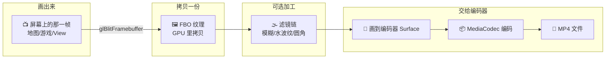

**一句话**：把「当前画在屏幕上的那一帧」在 GPU 里**拷贝**到 FBO → 可选地**加滤镜** → 再**画到编码器**的 Surface 上 → 编码器压成 H.264 → 写入
MP4。✨

---

## 二、📚 几个核心概念（带比喻）

| 名词                | 一句话解释                                                            | 🧩 打个比方                              |
|-------------------|------------------------------------------------------------------|--------------------------------------|
| **GLSurfaceView** | Android 里专门用来「画 OpenGL 内容」的控件，背后有一块给 GPU 画图的区域。                  | 一块**画布的外框**，规定画布多大、多久刷新一次。           |
| **Renderer**      | 你实现的接口，负责「每帧画什么」。系统在 GL 线程里反复调你的 `onDrawFrame()`，你在里面用 OpenGL 画。 | **画师**：每帧被叫醒一次，往当前画布上画一笔。            |
| **FBO**           | 一块**离屏画布**：不画到屏幕，而是画到 GPU 里的一块缓冲，画完可以当纹理继续用。                     | **草稿纸**：画完可以拿去「复印」（当纹理再画到别处）。        |
| **MediaCodec**    | 系统提供的**视频编码器**，把一帧帧图像压成 H.264。它不直接吃内存像素，要你往它给的 **Surface** 上画。   | 编码器只认「**画到指定 Surface 上的图**」，画一帧它编一帧。 |
| **Surface**       | 编码器「对外的一扇窗」：你把 OpenGL 的绘图目标切到这块 Surface，画上去的就自动喂给 MediaCodec。    | **橱窗**：你在这边贴画，编码器在另一边「拍照」，拍完就编成视频。   |

它们的关系可以概括成下面这张图：

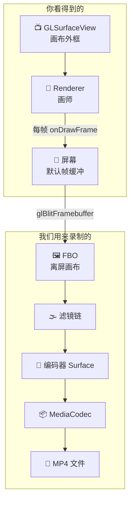

---

## 三、📺 GLSurfaceView 和 Renderer 怎么配合

GLSurfaceView 负责两件事：**弄出一块能画图的地方** + **开一条专门的 GL 线程**，按帧率（比如 60fps）不断喊「该画下一帧啦」。

你实现的 **Renderer** 就是「画师」，三个回调：

| 回调                 | 什么时候调             | 一般用来干啥                   |
|--------------------|-------------------|--------------------------|
| `onSurfaceCreated` | 画布**刚建好**时调**一次** | 创建纹理、编译 shader 等初始化      |
| `onSurfaceChanged` | **尺寸变了**时调一次      | 设置视口、投影等                 |
| **`onDrawFrame`**  | **每一帧都调** 🎬      | 用 OpenGL 画当前帧（地图、游戏、动画…） |

画完以后，**「当前绑定的帧缓冲」**里就是这一帧要显示的内容。我们要录的，就是这份内容～所以要先**拷贝**出来，而不是直接读回 CPU（那样太慢）。

时序可以理解成这样：

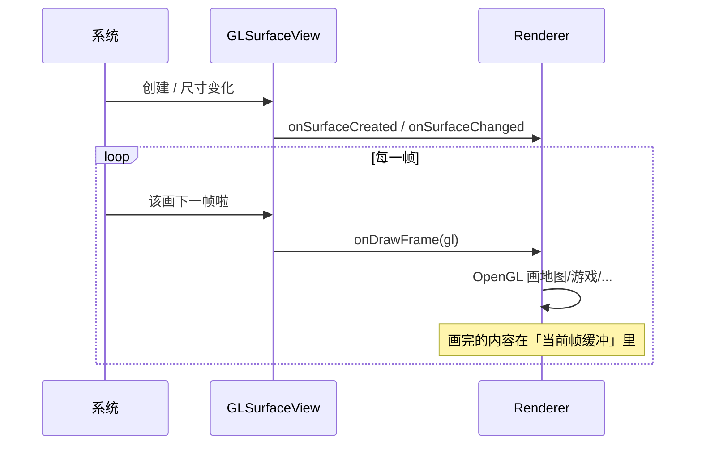

---

## 四、🖼️ FBO 是啥？为啥需要它？

**平时**：OpenGL 画的东西会画到**默认帧缓冲**，也就是「要显示到屏幕」的那块。如果为了录屏，用 `glReadPixels` 把像素读回 CPU 再送给编码器，会*
*很慢**而且容易卡住 GL 线程。

**FBO（Framebuffer Object）** 是另一块「帧缓冲」，可以绑上一张纹理：

- ✅ **离屏**：画到 FBO 不会直接上屏，不影响你看到的画面。
- ✅ **可当纹理用**：FBO 上绑的纹理里就是「刚画上去的那一帧」，可以在 GPU 里继续用这张图做模糊、水波纹等，**全程不读回 CPU**。

我们用的关键 API 是 **`glBlitFramebuffer`**（要 OpenGL ES 3.0）：把「当前帧缓冲」里的内容，**在 GPU 里**整块拷到「我们的
FBO」。这样就把「当前画面」抄到了一张纹理里，后面滤镜和编码都基于这张纹理。

对比一下「默认缓冲」和「FBO」：

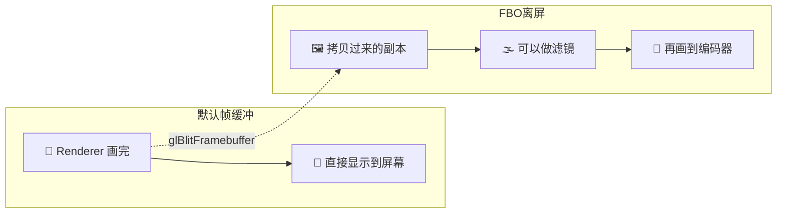

---

## 五、🚪 MediaCodec 和 Surface：画面怎么进编码器？

**MediaCodec** 是系统提供的视频编码器。你配置好宽高、码率、帧率等，调 `createInputSurface()`，它会给你一块 **Surface**。

这块 **Surface** 的含义是：**谁往这块 Surface 上画图，画上去的就是编码器的输入。** 编码器在另一侧按帧取图、压成 H.264，再交给 Muxer 写成 MP4。

我们这边用 **OpenGL 画**：

1. 通过 **EGL** 把「当前 GL 的绘图目标」**临时切到**这块 Surface（`eglMakeCurrent(..., encoderSurface, ...)`）
2. 用 OpenGL 画一个**铺满的四边形**，把我们要的那张纹理（FBO 或滤镜后的）贴上去
3. 调 **`eglSwapBuffers`** → 这一帧就交给 MediaCodec 了，编码器输出到 Muxer，最终写入文件

流程可以看成：

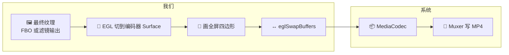

---

## 六、🔄 一整条逻辑流转：一帧是怎么变成文件的

用「一帧」的视角把上面全部串起来（就是本库 FBO 策略在干的事）：

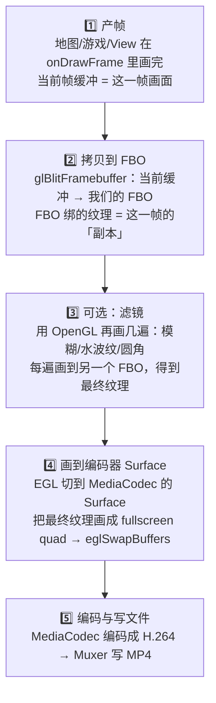

| 步骤          | 在干啥                             | 结果               |
|-------------|---------------------------------|------------------|
| 1️⃣ 产帧      | 某处（地图/游戏/View）画完当前帧             | 当前帧缓冲里是「要显示」的画面  |
| 2️⃣ 拷贝到 FBO | `glBlitFramebuffer` 在 GPU 里整块拷贝 | FBO 纹理里是这一帧的副本   |
| 3️⃣ 可选滤镜    | 对 FBO 纹理再做多次 OpenGL 绘制          | 得到「加完滤镜」的一张纹理    |
| 4️⃣ 画到编码器   | EGL 切到编码器 Surface，画全屏四边形 + swap | 这一帧进入 MediaCodec |
| 5️⃣ 编码与写文件  | MediaCodec 编码 → Muxer 写 MP4     | 文件里多了一帧          |

---

## 七、🌫️ 滤镜原理：为啥能加滤镜？为啥只影响录制？

**加滤镜的位置**：我们已经把「当前画面」拷到了**自己的 FBO 纹理**上。这张纹理和「正在显示的那一帧」是**分开的**，所以可以在 GPU
上对这张纹理再画几遍（模糊、水波纹、圆角），每次画到**另一个 FBO**，最后得到一张「处理过的」纹理。

**为啥只影响录制？**  
屏幕显示用的是**原始帧缓冲**里的内容；我们只是**拷贝了一份**到 FBO，滤镜只处理这份副本，再把副本画到编码器 Surface。所以：

- 👀 **屏幕上看到的** = 原始画面
- 📄 **文件里录下来的** = 带滤镜的画面

滤镜链在逻辑上就是一条「输入纹理 → 画到 FBO₁ → 输出纹理₁ → 再画到 FBO₂ → … → 最终纹理画到编码器」的流水线：

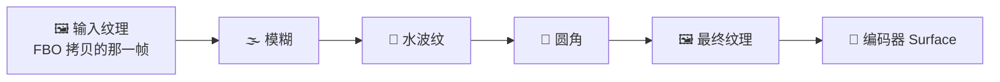

本库里的 BlurFilter、WaterRippleFilter、RoundCornerFilter 以及 `custom` 都是按这个思路：**输入一张纹理 ID，输出一张纹理 ID**，中间在自己 FBO
上画。

---

## 八、📖 小结

- **GLSurfaceView** = 画布外框，**Renderer** = 每帧在画布上画的画师，画完的内容在**当前帧缓冲**里。
- **FBO** = 离屏画布，用 **glBlitFramebuffer** 把当前画面拷到 FBO 纹理，**不读回 CPU**，高性能。
- **MediaCodec** 不直接吃像素，要你往它给的 **Surface** 上画；我们用 **EGL 切到这块 Surface**，用 OpenGL 把最终纹理画上去，再 *
  *eglSwapBuffers**，画面就进编码器 → Muxer → MP4。
- **滤镜**只作用在「FBO 拷贝出来的那份」上，所以**只影响录制，不影响屏幕**。

整条链：**产帧 → 拷到 FBO → 可选滤镜 → 画到编码器 Surface → 编码 → 写文件**。  
接下来可以打开 [FBO.md](FBO.md) 看 4 种使用方式、DSL 设计和实现细节啦～ 🚀

---

## 九、与库无关：系统与 API 全量知识点与调用顺序

本节只描述 **Android / OpenGL ES / EGL / MediaCodec**
的标准概念与常见调用顺序，不涉及任何具体库的实现。用语上用「应用」「开发者」「系统」等，方便单独理解「画面 → FBO → 编码 → 文件」这条链在系统层面的构成。

### 9.1 知识点全量清单（按模块）

以下均为系统/API 层面名称。

**View / 显示相关**

| 名称                   | 说明                                                     | 在流程中的角色                                                                  |
|----------------------|--------------------------------------------------------|--------------------------------------------------------------------------|
| **SurfaceView**      | 继承自 View，拥有一块独立 Surface，可在子线程绘制而不阻塞主线程。                | GLSurfaceView 的父类，提供「画布」的容器。                                             |
| **SurfaceHolder**    | Surface 的持有者，通过 `getHolder()` 拿到，用于获取/配置 Surface。      | GLSurfaceView 通过它拿到用于显示的 **Surface**。                                    |
| **Surface**（Android） | 表示一块「可绘图的缓冲区」，可由系统（Window/SurfaceView）或 MediaCodec 提供。 | 显示用：和 Window 关联，画上去就上屏；编码用：MediaCodec.createInputSurface() 返回的，画上去就进编码器。 |
| **Choreographer**    | 系统按 VSync 调度绘制。                                        | GLSurfaceView 内部会请求下一帧回调，与 Choreographer 协作，最终在 GL 线程调 onDrawFrame。      |

**EGL（显示/表面/上下文管理）**

| 名称                                                       | 说明                                                | 在流程中的角色                                                                              |
|----------------------------------------------------------|---------------------------------------------------|--------------------------------------------------------------------------------------|
| **EGLDisplay**                                           | 表示与「显示/图形系统」的连接。                                  | `eglGetDisplay(EGL_DEFAULT_DISPLAY)` 得到；`eglInitialize(display)` 后可用。                |
| **EGLConfig**                                            | 描述 EGL 的像素格式、Surface 类型等配置。                       | `eglChooseConfig(display, attribs, ...)` 选出；创建 **EGLContext** 和 **EGLSurface** 时都要用。 |
| **EGLContext**                                           | OpenGL 的「当前状态/上下文」（纹理、FBO、Program 等都属于某 context）。 | `eglCreateContext(display, config, ...)`；同一 context 下创建的资源可共享。                       |
| **EGLSurface**                                           | 一块「绘图表面」，绑定到某块缓冲。                                 | 两种：**WindowSurface**（关联 Android Surface，显示或编码器）、**PBufferSurface**（离屏，不显示）。          |
| **eglGetDisplay / eglInitialize**                        | 获取并初始化 Display。                                   | 任何 EGL 流程的第一步。                                                                       |
| **eglChooseConfig**                                      | 按属性选一个 Config。                                    | 创建 Context 和 Surface 前必须执行。                                                          |
| **eglCreateContext**                                     | 创建 OpenGL 上下文。                                    | 可指定 **EGL_CONTEXT_CLIENT_VERSION** 为 2 或 3（GLES 2.0/3.0）。                            |
| **eglCreateWindowSurface**                               | 用 Android 的 **Surface** 创建 EGLSurface（窗口型）。       | 显示：用 SurfaceHolder 的 Surface；编码：用 MediaCodec.createInputSurface() 的 Surface。         |
| **eglCreatePbufferSurface**                              | 创建离屏的 PBuffer Surface。                            | 无窗口时（纯后台渲染）用，需在 config 里加 EGL_PBUFFER_BIT。                                           |
| **eglMakeCurrent(display, draw, read, context)**         | 把当前线程的「绘制/读取目标」和「上下文」绑到指定 Surface。                | 之后所有 **glDraw*** 都画到 **draw**；切换绘制目标（如从屏幕切到编码器 Surface）必须调此 API。                     |
| **eglSwapBuffers(display, surface)**                     | 提交当前 Surface 的后缓冲，交换前后台。                          | 画完一帧后调用，显示用 Surface 会上屏，编码用 Surface 会让编码器取到这一帧。                                      |
| **eglDestroySurface / eglDestroyContext / eglTerminate** | 释放 Surface、Context、Display。                       | 逆序调用，避免悬空引用。                                                                         |

**OpenGL ES（绘制与帧缓冲）**

| 名称                                | 说明                                                                  | 在流程中的角色                                                                                                                                     |
|-----------------------------------|---------------------------------------------------------------------|---------------------------------------------------------------------------------------------------------------------------------------------|
| **默认帧缓冲（ID=0）**                   | `glBindFramebuffer(GL_FRAMEBUFFER, 0)` 时的目标，即「当前 EGLSurface 对应的缓冲」。 | 画到 0 就画到当前 EGL 的 Surface（屏幕或编码器）；`glGetIntegerv(GL_FRAMEBUFFER_BINDING)` 可拿到当前绑定 ID。                                                        |
| **FBO（Framebuffer Object）**       | 离屏帧缓冲，可绑定纹理或渲染缓冲。                                                   | `glGenFramebuffers` → `glBindFramebuffer` → `glFramebufferTexture2D` 绑定纹理；之后绘制目标变为该 FBO。                                                    |
| **纹理（Texture）**                   | 2D 贴图，可挂到 FBO 的 **COLOR_ATTACHMENT0**。                              | `glGenTextures`、`glBindTexture`、`glTexImage2D`/`glTexSubImage2D`；FBO 绑纹理后，画到 FBO 即写入该纹理，可供后续采样。                                             |
| **glViewport(x, y, w, h)**        | 设置当前视口。                                                             | 切换 FBO 或 Surface 后通常要设一次，否则绘制区域不对。                                                                                                          |
| **glBlitFramebuffer**             | 在 GPU 内把一块帧缓冲的区域拷贝到另一块（需 GLES 3.0）。                                 | 从「当前绑定的 FB」（如默认 0）拷到「我们的 FBO」，实现「当前画面 → 离屏纹理」不读回 CPU。                                                                                       |
| **Shader / Program**              | 顶点着色器 + 片元着色器链成 Program。                                            | `glCreateShader` → `glShaderSource` → `glCompileShader`；`glCreateProgram` → `glAttachShader` → `glLinkProgram`；绘制前 `glUseProgram(program)`。 |
| **glDrawArrays / glDrawElements** | 发起绘制。                                                               | 画到当前绑定的 FBO 或默认 FB；若当前 makeCurrent 的是编码器 Surface，则画进编码器。                                                                                    |

**MediaCodec / 编码**

| 名称                         | 说明                                    | 在流程中的角色                                                                                                                            |
|----------------------------|---------------------------------------|------------------------------------------------------------------------------------------------------------------------------------|
| **MediaCodec**             | 系统视频/音频编解码器。                          | 编码器：`createEncoderByType(MIMETYPE_VIDEO_AVC)` → `configure(format, null, null, ENCODE_FLAG)` → `createInputSurface()` → `start()`。 |
| **MediaFormat**            | 描述编码格式（宽高、码率、帧率、MIME 等）。              | `configure(codec, format, ...)`；**COLOR_FormatSurface** 表示输入来自 Surface。                                                            |
| **Surface**（编码器）           | `MediaCodec.createInputSurface()` 返回。 | 应用用 EGL 在该 Surface 上画图，画完 `eglSwapBuffers`，编码器从另一侧 dequeue 并编码。                                                                    |
| **dequeueOutputBuffer**    | 从编码器输出队列取一帧。                          | 循环调用；先得到 **INFO_OUTPUT_FORMAT_CHANGED**（取 outputFormat 给 Muxer），再得到每帧 **BufferInfo** 和 **ByteBuffer**。                             |
| **releaseOutputBuffer**    | 归还输出缓冲。                               | 应用用完该帧（如已写 Muxer）后必须调用，否则队列堵死。                                                                                                     |
| **signalEndOfInputStream** | 通知编码器不再有新输入。                          | 停止录制时调用，编码器会输出带 EOS 的最后一帧。                                                                                                         |
| **MediaCodec.BufferInfo**  | 描述一帧的 offset、size、pts、flags。          | dequeue 后填在 BufferInfo 里；写 Muxer 时用 **presentationTimeUs** 等。                                                                      |

**MediaMuxer / 容器**

| 名称                   | 说明                               | 在流程中的角色                                                                                                                                                                    |
|----------------------|----------------------------------|----------------------------------------------------------------------------------------------------------------------------------------------------------------------------|
| **MediaMuxer**       | 把编码后的视频/音频轨写入容器（如 MP4）。          | `new MediaMuxer(path, MUXER_OUTPUT_MPEG_4)` → **addTrack(format)**（视频用 encoder.outputFormat）→ **start()** → 每帧 **writeSampleData(trackIndex, buffer, info)** → **stop()**。 |
| **addTrack / start** | 先 add 所有轨再 start；start 后不能再 add。 | 视频轨通常在编码器 **OUTPUT_FORMAT_CHANGED** 时 add；start 必须在第一次 writeSampleData 前调。                                                                                                 |
| **writeSampleData**  | 写一帧编码数据。                         | 每帧从编码器 dequeue 后调用；**pts 须递增**（常用首帧归零）。                                                                                                                                    |

**其他（线程与缓冲）**

| 名称                       | 说明                     | 在流程中的角色                                                                              |
|--------------------------|------------------------|--------------------------------------------------------------------------------------|
| **GL 线程**                | 执行所有 EGL/OpenGL 调用的线程。 | GLSurfaceView 内部创建专用线程；**eglMakeCurrent** 后该线程的 GL 状态与当前 Display/Context/Surface 绑定。 |
| **ByteBuffer**（java.nio） | 编码器输出为 ByteBuffer。     | `encoder.getOutputBuffer(index)` 得到，交给 Muxer.writeSampleData。                        |
| **FloatBuffer**（顶点数据）    | 传给 GPU 的顶点/UV 数据。      | 全屏四边形等用 **glVertexAttribPointer** 传入。                                                |

### 9.2 通用代码调用顺序（链 A → 链 C → 链 B）

**三链合一总览**

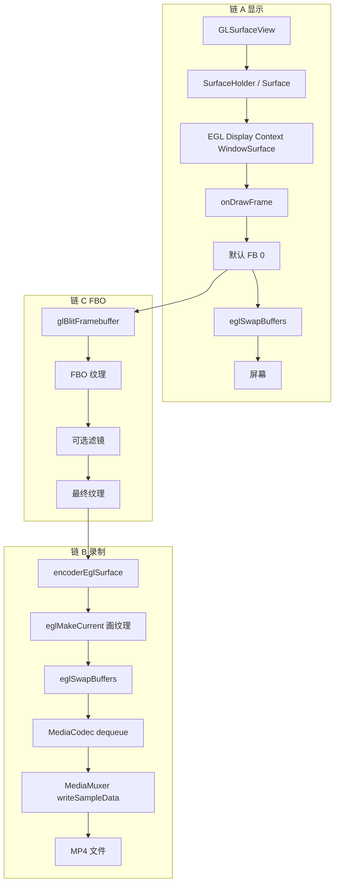

**链 A：显示路径（GLSurfaceView 从创建到每帧）**

1. 应用将 **GLSurfaceView** 挂到布局，系统创建 **Surface**（通过 SurfaceHolder）。
2. GLSurfaceView 内部启动 **GL 线程**，在该线程内：**eglGetDisplay(EGL_DEFAULT_DISPLAY)** → **eglInitialize** → **eglChooseConfig** → *
   *eglCreateContext** → **eglCreateWindowSurface(display, config, surface)**（surface 来自 SurfaceHolder）→ **eglMakeCurrent(display,
   eglSurface, eglSurface, context)** → 回调应用 **onSurfaceCreated**，若尺寸已知则回调 **onSurfaceChanged**。
3. 每帧：系统请求重绘 → GL 线程回调 **onDrawFrame** → 当前绑定为**默认帧缓冲 0**，对应上述 **EGLSurface**（即屏幕）→ 应用在 onDrawFrame 里 *
   *glClear / glDraw*** 等 → 内部 **eglSwapBuffers(display, eglSurface)** → 画面显示到 GLSurfaceView。

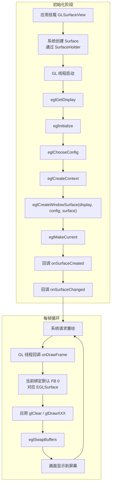

**链 B：录制路径（从编码器到 MP4）**

1. **MediaCodec**：**createEncoderByType(MIMETYPE_VIDEO_AVC)** → **configure(MediaFormat, null, null, CONFIGURE_FLAG_ENCODE)**（Format 含
   **COLOR_FormatSurface**）→ **createInputSurface()** 得到 **Surface**。
2. **MediaMuxer**：**new MediaMuxer(path, MUXER_OUTPUT_MPEG_4)** → 先不 start。
3. 在同一 GL 线程（或共享 context 的另一 GL 线程）：用上面得到的 **Surface** 做 **eglCreateWindowSurface(display, config, encoderSurface,
   attribs)** 得到 **encoderEglSurface**。需要画一帧时：**eglMakeCurrent(display, encoderEglSurface, encoderEglSurface, context)** → *
   *glViewport** → **glClear** → 用 OpenGL 把「要录的那一帧」（例如一张纹理）画满 → **eglSwapBuffers(display, encoderEglSurface)**。
4. **MediaCodec.start()** 后，另一线程（或同一线程）循环：**dequeueOutputBuffer(bufferInfo, timeout)**；若为 **INFO_OUTPUT_FORMAT_CHANGED**：*
   *getOutputFormat()** → **muxer.addTrack(format)** → **muxer.start()**（仅一次）；若为有效 index 且非 CODEC_CONFIG：**getOutputBuffer(
   index)** → **muxer.writeSampleData(videoTrackIndex, buffer, bufferInfo)** → **releaseOutputBuffer(index, false)**；若 *
   *BUFFER_FLAG_END_OF_STREAM**：结束循环。
5. **muxer.stop()** / **muxer.release()**；**codec.stop()** / **codec.release()**。

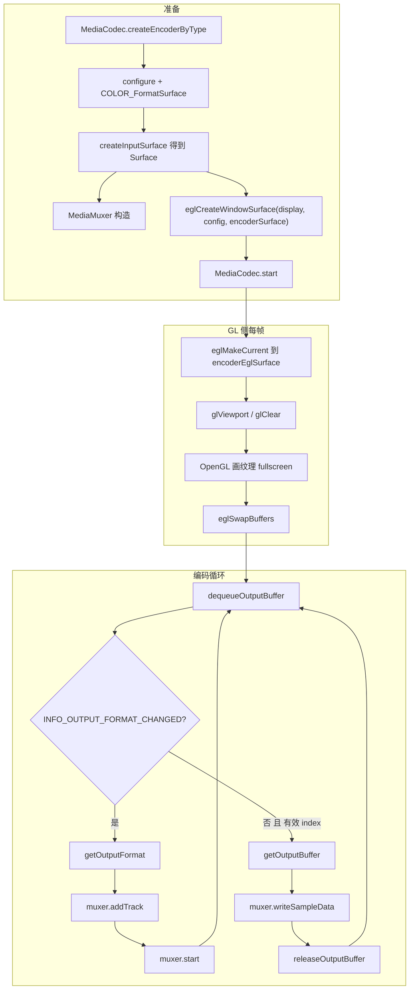

**链 C：FBO 如何接入（一帧内）**

在 **onDrawFrame**（或等价「每帧画完」）里，当前绑定的 FB 里已是「要显示的那一帧」：**glGetIntegerv(GL_FRAMEBUFFER_BINDING)** 得到当前 FB（可能是
0）→ **glGetIntegerv(GL_VIEWPORT)** 得到尺寸 → **glGenFramebuffers** + **glGenTextures** + **glTexImage2D** + **glFramebufferTexture2D**
建好「我们的 FBO」→ **glBindFramebuffer(GL_READ_FRAMEBUFFER, currentFbo)**；**glBindFramebuffer(GL_DRAW_FRAMEBUFFER, myFbo)**；*
*glBlitFramebuffer(...)** 把当前画面拷到 FBO 绑定的纹理 → **glBindFramebuffer(GL_FRAMEBUFFER, currentFbo)** 恢复。之后可用该纹理做滤镜（再画到其他
FBO），最后：**eglMakeCurrent(display, encoderEglSurface, encoderEglSurface, context)** → 把「最终纹理」画成 fullscreen quad → *
*eglSwapBuffers(display, encoderEglSurface)** → 再 **eglMakeCurrent** 回原来的 display/surface/context，恢复显示。

```mermaid
flowchart LR
    subgraph currentFB [当前帧缓冲]
        F1[onDrawFrame 画完\n当前 FB 为默认 0 或宿主 FBO]
    end
    subgraph copy [拷贝到 FBO]
        F2[glGetIntegerv 当前 FB 与 viewport]
        F3[glBindFramebuffer READ 当前]
        F4[glBindFramebuffer DRAW 我们的 FBO]
        F5[glBlitFramebuffer]
        F6[glBindFramebuffer 恢复]
        F2 --> F3 --> F4 --> F5 --> F6
    end
    subgraph optional [可选滤镜]
        F7[以 FBO 纹理为输入\n再画到其他 FBO]
        F8[得到最终纹理]
    end
    subgraph toEncoder [交给编码器]
        F9[eglMakeCurrent 到 encoderEglSurface]
        F10[画最终纹理 fullscreen]
        F11[eglSwapBuffers]
        F12[eglMakeCurrent 恢复显示]
        F9 --> F10 --> F11 --> F12
    end
    F1 --> F2
    F6 --> F7 --> F8 --> F9
```

### 9.3 EGL/GL 创建与销毁顺序小结

- **创建顺序**：EGLDisplay（eglGetDisplay + eglInitialize）→ EGLConfig（eglChooseConfig）→ EGLContext（eglCreateContext）→
  EGLSurface（eglCreateWindowSurface / eglCreatePbufferSurface）→ eglMakeCurrent。
- **销毁顺序**：eglMakeCurrent(display, EGL_NO_SURFACE, EGL_NO_SURFACE, EGL_NO_CONTEXT) → eglDestroySurface → eglDestroyContext →
  eglTerminate(display)。

---

## 十、本库里的「谁调谁」：类 + 方法调用链（细节到方法）

下面按「**谁调用了哪个类的哪个方法，之后应该/会调用哪一个方法**」列清楚，方便你对着代码跟调用链。

### 10.1 从「开始录制」到「第一帧」：Session 与初始化

| 顺序 | 谁调谁                                                                       | 之后会怎样                                                                                                                                                                                                                                                           |
|----|---------------------------------------------------------------------------|-----------------------------------------------------------------------------------------------------------------------------------------------------------------------------------------------------------------------------------------------------------------|
| 1  | 用户调 `OSR.recorder(context, config)`（config 里已 `fbo { }` 过）                | 内部取 `config.renderStrategy`，即 `FboStrategy`                                                                                                                                                                                                                     |
| 2  | 内部调 `FboStrategy.createSession(context, config)`                          | 内部 `new FboRecorderSession(context, config, fboConfig)`，再调 `session.prepare()`                                                                                                                                                                                  |
| 3  | `FboRecorderSession.prepare()`                                            | 里会依次：`encoderController.prepare()` → `muxerController.prepare()` → `audioMixer?.prepare()`；根据 `sourceConfig` 创建 `FrameCaptureRenderer` 和一种 `FrameSource`（如 `CaptureRendererSource` / `GLSurfaceViewSource` / `OffscreenSource` / `ViewSource`），然后返回 session 给用户 |
| 4  | 用户调 `session.startRecord()`                                               | 进入 `FboRecorderSession.startRecord()`                                                                                                                                                                                                                           |
| 5  | `FboRecorderSession.startRecord()` 里先调 `captureRenderer?.initGL()`        | 进入 `FrameCaptureRenderer.initGL()`：创建 FBO、`EglSurfaceManager`、`TextureProgram`，调 `filterPipeline.init(width, height)`（每个 Filter 的 `init` 被调一次）                                                                                                                  |
| 6  | 接着 `encoderController.start()`、`encoderController.launchEncoderLoop(...)` | 编码器开始工作；`onFormatChanged` 回调里会 `muxerController.addVideoTrack(format)`、`muxerController.start()`、`audioMixer?.startMixing(scope)`                                                                                                                               |
| 7  | 最后 `frameSource?.start()`                                                 | 根据模式：方式 1/2 只是 `recording = true`，等宿主每帧 `onDrawFrame`；方式 3/4 会起协程，里面对应调 `EglHelper.init()`、`createPbufferSurface`、`makeCurrent()`，然后循环里每帧调 `renderer.onDrawFrame` / View 绘制，再调 `captureCallback.captureFrame()`                                                 |

### 10.2 每一帧：从「画完」到「写进 MP4」（方式 1 / 2 为例）

以**方式 1（CaptureRenderer）**或**方式 2（GLSurfaceView）**为例，一帧里「回调之后该调哪个方法」的链如下。

| 顺序 | 类.方法（谁被调）                                                                                                   | 谁调的                                                 | 该方法里接下来会调谁                                                                                                                                       |
|----|-------------------------------------------------------------------------------------------------------------|-----------------------------------------------------|--------------------------------------------------------------------------------------------------------------------------------------------------|
| 1  | `GLSurfaceView` 内部 / 系统                                                                                     | 系统按帧率请求重绘                                           | 当前绑定的 `Renderer.onDrawFrame(gl)`                                                                                                                 |
| 2  | `CaptureRendererSource.onDrawFrame(gl)` 或 装饰器里的 `userRenderer.onDrawFrame(gl)` 先执行完                         | GLSurfaceView / 系统                                  | 方式 1：我们自己的 renderer 里 `if (recording) captureCallback.captureFrame()`；方式 2：先 userRenderer 画完，再 `captureCallback.captureFrame()`                  |
| 3  | `FrameCaptureCallback.captureFrame()`，实现类是 `FrameCaptureRenderer` → 即 `FrameCaptureRenderer.captureFrame()` | 上面的 `CaptureRendererSource` / `GLSurfaceViewSource` | 内部：保存 EGL 状态 → `glGetIntegerv(GL_FRAMEBUFFER_BINDING)`、`GL_VIEWPORT` → `glBlitFramebuffer` 拷到自己的 FBO → **`filterPipeline.render(fboTexId)`**     |
| 4  | `FilterPipeline.render(inputTexture)`                                                                       | `FrameCaptureRenderer.captureFrame()`               | 对每个 Filter 依次 `current = filter.apply(current)`，返回最终纹理 ID                                                                                        |
| 5  | 例如 `BlurFilter.apply(inputTexture)`                                                                         | `FilterPipeline.render()`                           | 画到自己的 FBO（水平/垂直两趟），返回输出纹理 ID；下一个 Filter 的 `apply` 会收到这个 ID                                                                                       |
| 6  | 回到 `FrameCaptureRenderer.captureFrame()`，拿到 `outputTex`                                                     | —                                                   | **`eglSurfaceManager?.makeCurrent()`** → `glViewport`、`glClear` → **`textureProgram?.draw(outputTex)`** → **`eglSurfaceManager?.swapBuffers()`** |
| 7  | `EglSurfaceManager.makeCurrent()`                                                                           | `FrameCaptureRenderer.captureFrame()`               | 当前 GL 绘制目标切到编码器 Surface；之后 GL 的绘制都进编码器                                                                                                           |
| 8  | `TextureProgram.draw(textureId)`                                                                            | `FrameCaptureRenderer.captureFrame()`               | 内部调 `GlUtil.drawTexture(program, textureId)`，把纹理画满当前绑定的 Surface（即编码器 Surface）                                                                    |
| 9  | `EglSurfaceManager.swapBuffers()`                                                                           | `FrameCaptureRenderer.captureFrame()`               | 这一帧提交给 MediaCodec；编码器在另一侧 dequeue 到后编码                                                                                                           |
| 10 | `EncoderController` 内部编码循环 `dequeueOutputBuffer` 拿到一帧                                                       | 编码器产出                                               | 调 Session 传进来的 **`onFrame(buffer, info)`** 回调                                                                                                    |
| 11 | `FboRecorderSession` 里传入的 `onFrame`                                                                         | `EncoderController.launchEncoderLoop`               | 里调 `ptsNormalizer.normalize(info)`，再 `muxerController.writeSampleData(trackIndex, buffer, info)`，这一帧就写入 MP4                                      |

用流程图串起来（一帧内，方式 1/2）：

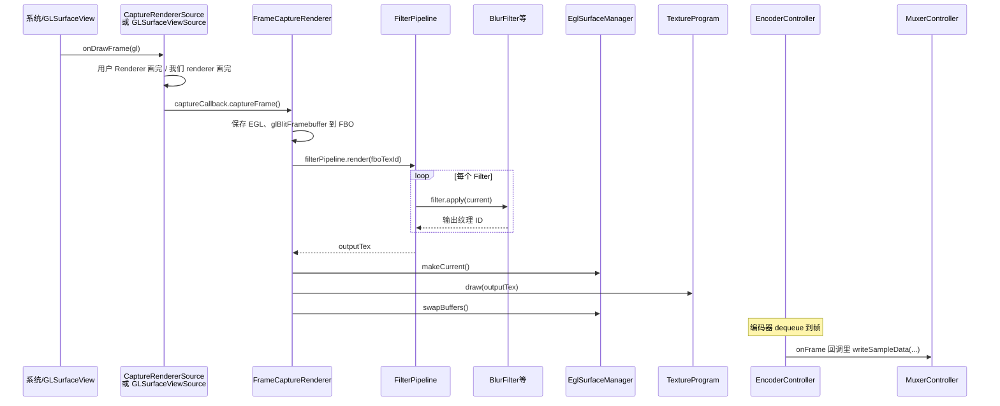

### 10.3 方式 3（Offscreen）/ 方式 4（View）和上面有啥不同

- **谁触发「每帧」**：不是系统 `onDrawFrame`，而是 **OffscreenSource** 或 **ViewSource** 的协程循环。
- **OffscreenSource**：`start()` 里 `launch` 协程 → `EglHelper.init()`、`createPbufferSurface`、`makeCurrent()` → 循环里每帧先 *
  *`renderer.onDrawFrame(null)`**，再 **`captureCallback.captureFrame()`**。  
  也就是说：**`renderer.onDrawFrame` 回调之后，下一次调用的就是 `FrameCaptureRenderer.captureFrame()`**。
- **ViewSource**：循环里每帧 **`drawViewToBitmap()`**（主线程 `view.draw(canvas)`）→ **`uploadBitmapToTexture()`** → *
  *`captureCallback.captureFrame()`**。  
  即：**View 画到 Bitmap 并上传纹理之后，调用的就是 `FrameCaptureRenderer.captureFrame()`**。
- **captureFrame 之后**：和 10.2 完全一样——`filterPipeline.render` → `eglSurfaceManager.makeCurrent` → `textureProgram.draw` →
  `eglSurfaceManager.swapBuffers()`，编码器侧 `onFrame` → `muxerController.writeSampleData`。

### 10.4 小结表：关键「回调 / 方法之后该调谁」

| 你看到的回调/方法                             | 所在类                                            | 之后会调用的类.方法（下一环）                                                                                                                                        |
|---------------------------------------|------------------------------------------------|--------------------------------------------------------------------------------------------------------------------------------------------------------|
| `onDrawFrame(gl)`                     | 系统调我们的 Renderer（如 CaptureRendererSource / 装饰器） | 我们内部 → `captureCallback.captureFrame()`，即 **FrameCaptureRenderer.captureFrame()**                                                                      |
| `FrameCaptureRenderer.captureFrame()` | 各 FrameSource                                  | **FilterPipeline.render(fboTexId)** → 再 **EglSurfaceManager.makeCurrent()** → **TextureProgram.draw(outputTex)** → **EglSurfaceManager.swapBuffers()** |
| `FilterPipeline.render()`             | FrameCaptureRenderer                           | 对每个 Filter 依次 **Filter.apply(current)**，最后一个的返回值作为 outputTex                                                                                           |
| `Filter.apply(inputTexture)`          | FilterPipeline                                 | 各 Filter 内部画到自己的 FBO，**返回输出纹理 ID** 给 Pipeline，Pipeline 再传给下一个 Filter 或返回给 FrameCaptureRenderer                                                         |
| `EglSurfaceManager.swapBuffers()`     | FrameCaptureRenderer                           | 这一帧交给 MediaCodec；之后 **EncoderController** 内部 dequeue 到帧时会调我们传的 **onFrame**                                                                             |
| `onFormatChanged(format)`             | EncoderController 在编码循环里调一次                    | 我们传的 lambda 里：**MuxerController.addVideoTrack(format)**、**MuxerController.start()**、**AudioMixer.startMixing(scope)**                                  |
| `onFrame(buffer, info)`               | EncoderController 每编出一帧调一次                     | 我们传的 lambda 里：**PtsNormalizer.normalize(info)**，再 **MuxerController.writeSampleData(...)**                                                             |

这样就能从「**某个回调/方法被调了**」一路跟到「**下一个被调的是哪个类的哪个方法**」。
