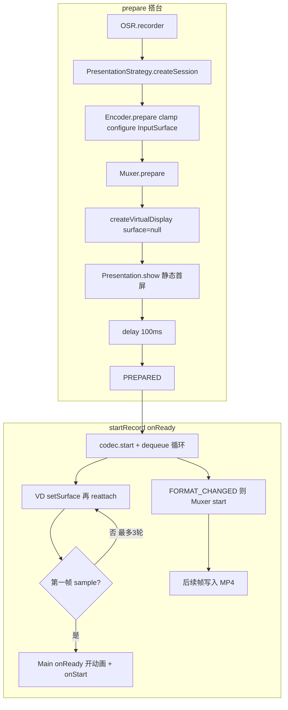
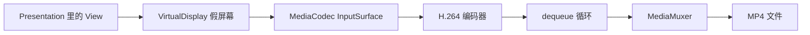

# OffScreenRecorder

Android 离屏录制库：在虚拟 Display 上渲染 UI 并录制为 MP4，无需 MediaProjection、无需敏感权限。

## 现有实现（Presentation 链路）

App 不截真实屏幕，而是造一块「假屏幕」（VirtualDisplay），把 UI 画在上面，GPU 画面直接进 H.264 编码器，再和可选音频一起写成 MP4。库模块是 `:osr`，Demo 在 `:app`。下文以 *
*Presentation** 路径为主（FBO 是另一条 OpenGL 路，不经过 VirtualDisplay）。

### 角色表

| 类                             | 文件                                                                                                | 干什么                                                                 |
|-------------------------------|---------------------------------------------------------------------------------------------------|---------------------------------------------------------------------|
| `OSR`                         | [OSR.kt](osr/src/main/kotlin/osp/osr/OSR.kt)                                                      | 门口：校验配置，交给渲染策略                                                      |
| `PresentationStrategy`        | [PresentationStrategy.kt](osr/src/main/kotlin/osp/osr/pres/PresentationStrategy.kt)               | 创建 Session 并立刻 `prepare()`                                          |
| `PresentationRecorderSession` | [PresentationRecorderSession.kt](osr/src/main/kotlin/osp/osr/pres/PresentationRecorderSession.kt) | 导演：按顺序叫下面几个工人                                                       |
| `EncoderController`           | [EncoderController.kt](osr/src/main/kotlin/osp/osr/core/encoder/EncoderController.kt)             | 按 `strictAvcLevel41` 阶梯对齐/MaxFS/720p 后 configure；第一帧供握手 / `onReady` |
| `VirtualDisplayManager`       | [VirtualDisplayManager.kt](osr/src/main/kotlin/osp/osr/pres/VirtualDisplayManager.kt)             | 可 `surface=null` 创建假屏幕，之后 `setSurface` 再绑编码器                        |
| `PresentationController`      | [PresentationController.kt](osr/src/main/kotlin/osp/osr/pres/PresentationController.kt)           | 在假屏幕上 `show` 用户的 Presentation                                       |
| `MuxerController`             | [MuxerController.kt](osr/src/main/kotlin/osp/osr/core/muxer/MuxerController.kt)                   | 把编码后的数据写成 MP4。**没 start 之前写入会被直接丢掉**                                |
| `AudioMixer`                  | 可选                                                                                                | 背景 AAC 混进同一 MP4                                                     |

### 两阶段：先搭台子，再开拍

状态机：`IDLE → PREPARING → PREPARED → RECORDING → STOPPING → RELEASED`。

**阶段 A：`prepare()`（搭台，编码器还没 start）**

1. `encoderController.prepare()`：按开关 align / MaxFS / 720p 阶梯 → configure → `createInputSurface()`，**不** `codec.start()`
2. `muxerController.prepare()`：打开 MP4 文件，还不能写帧
3. `createDisplay(surface=null, …, densityDpi 以配置 dpi 为基准并按 encodeW/screenW 缩放)`
4. `presentationController.show(display)`：静态首屏（先别开动画）
5. `delay(100)`：约 2～3 个 Vsync

**阶段 B：`startRecord(onReady)`（开拍）**

1. `encoderController.start()` → 底层 `codec.start()` + `launchEncoderLoop`（后台 dequeue）
2. VD：`setSurface(encoder)` → `delay(50)` → 解绑再绑（最多 3 轮）
3. 等第一帧可写 sample（非 `CODEC_CONFIG`）；循环里收到 `INFO_OUTPUT_FORMAT_CHANGED` 时 `muxer.addVideoTrack` + `muxer.start()`
4. 主线程：`onReady`（UI 开动画）+ `listener.onStart`
5. Muxer 未 start 前的帧仍被丢弃（`writeSampleData` 守卫）

### 总流程图



### 数据流（画面怎么变成文件）



记住四件事：

1. **假屏幕必须把画面送到 Surface**，编码器才有输入。
2. **编码器必须 start 之后**，才从 Surface 正经取帧。
3. **Muxer 必须等格式回调后 start**，之前的帧全部丢弃。
4. **UI 动画放在 `onReady`（第一帧之后）**，避免缺开头。

大屏 configure / ColorOS 空视频 / 华为黑首帧等说明见：[osr/docs/2026-08-29-virtual-display-encoder-fix.md](osr/docs/2026-08-29-virtual-display-encoder-fix.md)。

## 特性

- 不使用 MediaProjection，不申请系统敏感权限
- MediaCodec Surface 直连 VirtualDisplay，GPU 渲染零拷贝
- Kotlin DSL + Builder 两种使用方式
- 协程架构，支持可选音频混合（设置音频文件，短则循环）
- 策略模式：支持 Presentation / FBO 等多种渲染方式，公共配置与渲染实现解耦
- 大屏可配 `strictAvcLevel41`（先 MaxFS 或先冲屏部分辨率再降级）；VD 延后绑 Surface；`startRecord(onReady)` 等第一帧再开动画
- 宽高默认屏幕像素，`densityDpi` 默认设备 dpi

## 集成

在应用模块的 `build.gradle.kts` 中：

```kotlin
dependencies {
    implementation(project(":osr"))
}
```

## 基本使用（DSL）

在 `OSR.recorder { }` 中配置视频、输出文件、可选音频和可选监听，然后选择渲染策略（如 `presentation { }`）。录制开始/结束在 Presentation 内调用
`session.startRecord(onReady = { … })` / `session.stopRecord()`。动画应放在 `onReady` 里，不要在编码握手前抢跑。

- **audio**：可选。设置后保存视频时自动混入该音频；音频短于视频时长时会从头循环填充。
- **listener**：可选。按需设置 `onStart` / `onStop` / `onSaved` / `onError`，不关心的可不写。`onStart` 与 `onReady` 在同一时刻（第一帧之后）触发。
- **presentation**：选择 Presentation 渲染策略（来自 `osp.osr.pres` 包的扩展函数）。

`OSR.recorder()` 是 suspend 函数，需在协程作用域中调用：

```kotlin
import osp.osr.OSR
import osp.osr.pres.presentation  // 扩展函数

lifecycleScope.launch {
    val session = OSR.recorder(context) {

        video {
            // width/height/dpi 可不写 → 屏幕像素 + 设备 dpi
            // strictAvcLevel41 = false  // 先 16 对齐冲高清；configure 失败再 MaxFS，再失败 720p
            fps = 30
            bitrate = 4_000_000
        }

        output {
            file = File(context.filesDir, "demo.mp4")
        }

        // 可选：混入背景音，短则循环
        audio {
            file = File(context.filesDir, "bgm.aac")
        }

        // 可选：按需监听
        listener {
            onStart = { }
            onStop = { }
            onSaved = { file -> }
            onError = { error -> }
        }

        // 渲染策略：Presentation
        presentation { display, session ->
            DemoPresentation(context, display, session)
        }
    }
}
```

## 在 Presentation 中控制录制

由 Presentation 决定何时开始、何时结束录制；**开动画放在 `onReady`**：

```kotlin
class DemoPresentation(
    context: Context,
    display: Display,
    private val session: RecorderSession
) : Presentation(context, display) {

    override fun onCreate(savedInstanceState: Bundle?) {
        super.onCreate(savedInstanceState)
        val content = DemoView(context)
        setContentView(content)

        // 静态首屏先出画；等编码器第一帧后再开动画，避免缺开头
        session.startRecord(onReady = { content.startAnimation() })

        content.setOnAnimationEndListener {
            session.stopRecord()
        }
    }
}
```

## Builder 方式

使用 `RecorderConfig.Builder` 构建配置，再通过 `OSR.recorder(context, config)` 创建 Session：

```kotlin
import osp.osr.pres.PresentationStrategy

val config = RecorderConfig.Builder()
    .setVideoSize(1080, 1920)
    .setFps(30)
    .setBitrate(4_000_000)
    .setAudioFile(File("bgm.aac"))   // 可选
    .setOutputFile(File(context.filesDir, "demo.mp4"))
    .setRenderStrategy(PresentationStrategy { display, session ->
        DemoPresentation(context, display, session)
    })
    .setListener {
        onSaved = { file -> }
    }
    .build()

lifecycleScope.launch {
    val session = OSR.recorder(context, config)
}
```

## 配置说明

| 配置项              | 说明                                                        | 默认值                    |
|------------------|-----------------------------------------------------------|------------------------|
| width / height   | 视频宽高；`<=0` 时用屏幕像素                                         | 屏幕宽高                   |
| densityDpi       | VD 密度基准；`<=0` 时用设备 dpi；尺寸被缩小时仍按 encodeW/screenW 同比缩放      | 设备 dpi                 |
| strictAvcLevel41 | `true`：先 MaxFS=8192 纠正；`false`：先 16 对齐，失败再 MaxFS，再失败 720p | true                   |
| fps              | 帧率                                                        | 30                     |
| bitrate          | 码率（bps）                                                   | 4_000_000              |
| iFrameInterval   | 关键帧间隔（秒）                                                  | 1                      |
| output file      | 输出 MP4 路径                                                 | 必填                     |
| audio file       | 背景音文件（可选）                                                 | null                   |
| renderStrategy   | 渲染策略                                                      | 必填（presentation / fbo） |

## 架构

```
OSR.recorder { }
    → RecorderConfig（公共配置）
    → RenderStrategy.createSession()（策略工厂）
        → PresentationRecorderSession  （Presentation 方案）
        → FboRecorderSession           （FBO 方案）
```

公共配置 (`osp.osr`) 与渲染实现 (`osp.osr.pres` / `osp.osr.fbo`) 完全解耦，通过扩展函数注入。

## 依赖

- AndroidX Core、AppCompat、Material
- Kotlin Coroutines
- minSdk 29

## License

见项目 LICENSE 文件。
