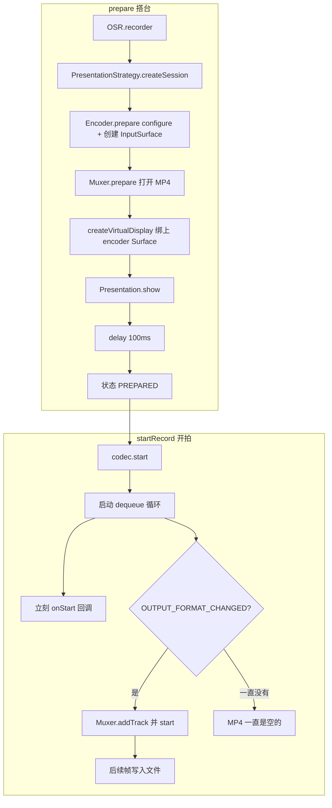
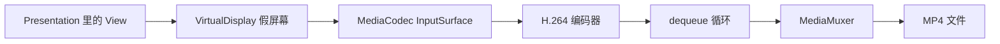
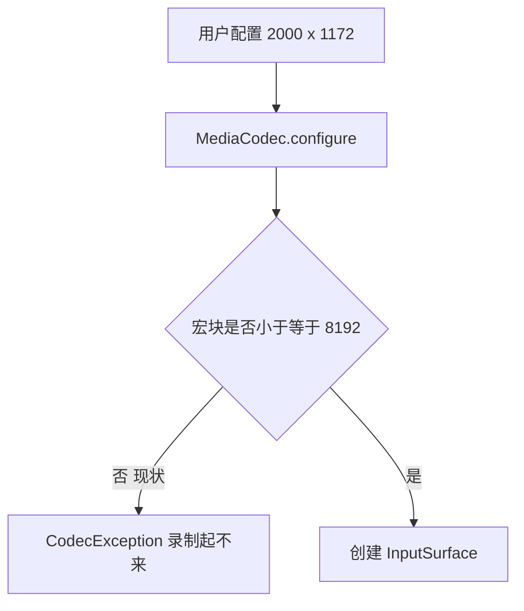
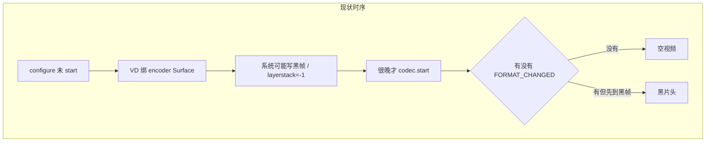
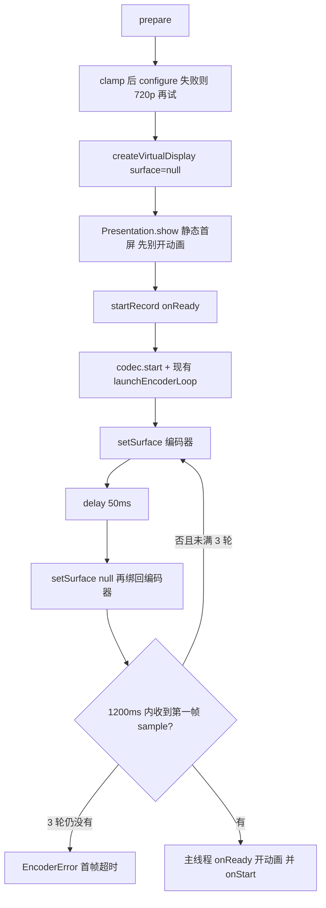

> **学习用存档**：VirtualDisplay + MediaCodec 离屏录制修复说明。  
> 对应实现：`AvcSize` / `EncoderController` / `VirtualDisplayManager` / `PresentationRecorderSession` / `startRecord(onReady)`。  
> 原 Cursor 计划文件：`.cursor/plans/vd_encoder_fix_*.plan.md`（可忽略）。

# 离屏录制两个问题：现状、故障、再改（小白版）

本文先讲 **现在代码怎么跑**，再讲 **会在哪炸掉**，最后才是 **改哪几行**。不要求你先懂 MediaCodec。

---

# 第一部分：现有实现（代码在干什么）

## 1.1 一句话

App 不截真实屏幕，而是造一块「假屏幕」（VirtualDisplay），把 UI 画在上面，GPU 画面直接进 H.264 编码器，再和可选音频一起写成 MP4。

库模块是 `**:osr**`。Demo 在 `**:app**`。和这次问题相关的 **只有 Presentation 这条路**（FBO 是另一条 OpenGL 路，不经过 VirtualDisplay）。

## 1.2 角色表（类 = 工种）


| 类                             | 文件                                                                                                | 干什么                                   |
| ----------------------------- | ------------------------------------------------------------------------------------------------- | ------------------------------------- |
| `OSR`                         | [OSR.kt](osr/src/main/kotlin/osp/osr/OSR.kt)                                                      | 门口：校验配置，交给渲染策略                        |
| `PresentationStrategy`        | [PresentationStrategy.kt](osr/src/main/kotlin/osp/osr/pres/PresentationStrategy.kt)               | 创建 Session 并立刻 `prepare()`            |
| `PresentationRecorderSession` | [PresentationRecorderSession.kt](osr/src/main/kotlin/osp/osr/pres/PresentationRecorderSession.kt) | 导演：按顺序叫下面几个工人                         |
| `EncoderController`           | [EncoderController.kt](osr/src/main/kotlin/osp/osr/core/encoder/EncoderController.kt)             | 建 H.264 编码器，产出一块「往上画画就会变成视频」的 Surface |
| `VirtualDisplayManager`       | [VirtualDisplayManager.kt](osr/src/main/kotlin/osp/osr/pres/VirtualDisplayManager.kt)             | 用那块 Surface 创建假屏幕，得到 `Display`        |
| `PresentationController`      | [PresentationController.kt](osr/src/main/kotlin/osp/osr/pres/PresentationController.kt)           | 在假屏幕上 `show` 用户的 Presentation         |
| `MuxerController`             | [MuxerController.kt](osr/src/main/kotlin/osp/osr/core/muxer/MuxerController.kt)                   | 把编码后的数据写成 MP4。**没 start 之前写入会被直接丢掉**  |
| `AudioMixer`                  | 可选                                                                                                | 背景 AAC 混进同一 MP4                       |


配置里的宽高来自 DSL，例如 Demo 里常见 `1080×1920`（[MainActivity](app/src/main/java/com/osr/demo/MainActivity.kt)）。用户若改成平板分辨率（如 `2000×1172`），就会撞上问题 1。

## 1.3 两阶段：先搭台子，再开拍

状态机：`IDLE → PREPARED → RECORDING → STOPPING → RELEASED`。

**阶段 A：`prepare()`（搭台，编码器还没 start）**

现在代码顺序（[PresentationRecorderSession.prepare](osr/src/main/kotlin/osp/osr/pres/PresentationRecorderSession.kt)）：

1. `encoderController.prepare()`：按 `videoConfig` 宽高 `MediaCodec.configure`，`createInputSurface()`，**不** `codec.start()`
2. `muxerController.prepare()`：打开 MP4 文件，还不能写帧
3. `displayManager.createDisplay(encoderSurface, videoConfig)`：**创建假屏幕时就把编码器 Surface 绑上去**
4. `presentationController.show(display)`：用户 UI 出现在假屏幕上
5. `delay(100)`：等大约 2～3 个 Vsync

**阶段 B：`startRecord()`（开拍）**

1. `encoderController.start()` → 底层 `codec.start()`
2. `launchEncoderLoop`：后台协程里反复 `dequeueOutputBuffer`
3. 立刻 `notifier.notifyStart()`（用户的 `listener.onStart`）

编码循环里关键一步：第一次收到 `INFO_OUTPUT_FORMAT_CHANGED` 时，才会 `muxer.addVideoTrack` + `muxer.start()`。在此之前，`writeSampleData` 是空操作（[MuxerController 第 92 行](osr/src/main/kotlin/osp/osr/core/muxer/MuxerController.kt) `if (!started) return`）。

## 1.4 现有总流程图




## 1.5 数据流（画面怎么变成文件）




记住三件事就能看懂后面的 bug：

1. **假屏幕必须把画面送到 Surface**，编码器才有输入。
2. **编码器必须 start 之后**，才从 Surface 正经取帧。
3. **Muxer 必须等格式回调后 start**，之前的帧全部丢弃。

---

# 第二部分：可能出什么问题

## 2.1 问题 1：大屏 `configure` 直接失败

**现象：** 平板 / 大分辨率（例如 2000×1172）在 `encoder.prepare()` 里崩溃或走 `onError`，录制起不来。日志里常见 `MediaCodec.CodecException`，错误码 `0xfffffc0e`（高通硬编拒绝）。

**现有代码：** [EncoderController.prepare](osr/src/main/kotlin/osp/osr/core/encoder/EncoderController.kt) 把 `videoConfig.width/height` **原样**传给 `configure`，没有 16 对齐，没有检查「宏块数」，失败也没有换更小分辨率再试。

**为什么会拒绝（人话）：**

H.264 把画面切成 16×16 的小块，叫宏块。数量 ≈ `(宽/16) × (高/16)`。

常见手机档 **AVC Level 4.1** 规定：宏块上限 **8192**。

例子：`2000×1172` 对齐后很容易超过 8192，硬编在 configure 阶段就说「我编不了这么大」。

**不是**「先录再缩小」，而是 **编码器根本创建失败**。




**顺带坑：** 就算以后缩小了编码宽高，若 VirtualDisplay 的 **dpi 仍用手机原 dpi**，假屏幕会按「小画布 + 高密度」去排版，UI 看起来像被放大、糊或裁切。所以缩小分辨率时，密度要按 `原 dpi × 编码宽 / 屏幕宽` 一起缩小。

## 2.2 问题 2：ColorOS 空视频 / 华为黑首帧

**现象 A（ColorOS）：** VirtualDisplay 创建成功，但 `dumpsys SurfaceFlinger` 里这个 Display 的 `layerstack=-1`。编码器一直等不到帧，Muxer 迟迟不 start，成片空白或进度卡住。

**现象 B（华为等）：** 能出片，但开头一长段黑。

**现有代码的时间顺序（这是根因）：**

```text
现在：
  1. 编码器 configure，但还没 start
  2. 立刻用 encoder Surface 创建 VirtualDisplay   ← 假屏幕开始往 Surface 里塞画面
  3. Presentation 开始画
  4. 过很久用户才 startRecord → codec.start()
```

**ColorOS：** `OWN_CONTENT_ONLY` 的假屏幕刚创建时，layerstack 可能短暂是 `-1`（等于「这层还不归任何合成栈」）。若在这个窗口把 encoder Surface 绑死，有的机型 **之后再也不往这块 Surface 送帧**。你后面 `codec.start()` 也好，dequeue 也只是空转。

**华为：** 假屏幕在 **编码器尚未 start** 时就往 Surface 写（常常是黑的初始帧）。这些帧进了 BufferQueue。编码器一 start，先编到的就是黑帧，像「片头黑屏」。

**和 Muxer 的叠加：** 就算后面有帧，若 `OUTPUT_FORMAT_CHANGED` 一直不来，Muxer 永不 start，所有 `writeSampleData` 都被丢掉 → 空文件。




## 2.3 现状里已经做对的部分（不要改坏）

- 编码循环已在协程里 dequeue，不是主线程死循环。
- Muxer 未 start 时丢帧：握手阶段多 dequeue 几次不会把垃圾写进文件。
- FBO 方案不走 VirtualDisplay，问题 2 与它无关；问题 1 的 clamp 放在 `EncoderController.prepare`，FBO 会自动变安全。

## 2.4 现在动画为什么容易缺开头 / 对不齐

[MapTrackPresentation](app/src/main/java/com/osr/demo/ui/presentation/MapTrackPresentation.kt)：`startRecord()` → `delay(1000)` → 开轨迹。

[ColorChangePresentation](app/src/main/java/com/osr/demo/ui/presentation/ColorChangePresentation.kt)：`onCreate` 里 View 已经 `start()` 循环变色，并在 View 的 `onStart` 里才 `session.startRecord()`——动画可能比编码器还早。

`startRecord()` 立刻 `notifyStart`，**没有**「画面已经进文件了」这个信号。UI 只能猜（sleep 1 秒），猜早了开头被 Muxer 丢掉，猜晚了片头发呆。

---

## 2.5 为什么 `startRecord(onReady)` +「第一帧」比等 FORMAT_CHANGED 更好

**结论：更好。** ready 应在 **已经编出第一帧可写入的视频数据** 时触发（`size > 0` 且不是 `CODEC_CONFIG`），并且这时 Muxer 一定已经 start（循环里格式回调在先、帧在后）。UI **只在 onReady 里开动画**。


| 信号                           | 它实际表示                             | 用来开动画够不够                                       |
| ---------------------------- | --------------------------------- | ---------------------------------------------- |
| `codec.start()` 刚返回          | 编码器开机了                            | 不够。Surface 可能还没画面                              |
| `INFO_OUTPUT_FORMAT_CHANGED` | 编码器给出 SPS/PPS、可以 addTrack         | 不够。ColorOS 空视频时仍可能有格式、**没有像素**。这时开动画等于对着黑洞演    |
| **第一帧 sample**               | GPU → Surface → 编码器 → 输出队列里真有一块画面 | **够。** 管线通了，这帧会进 MP4（Muxer 已 start），再开动画开头不会被丢 |


对应关系（人话）：

- **FORMAT_CHANGED** = 「相机装好胶卷了」
- **第一帧** = 「已经拍下第一张照片了」
- 动画是「演员开始走位」：必须先确认相机在出片，再走位，否则走位发生在快门打开之前。

因此：

1. **API 放在 `startRecord(onReady)`**：开动画的人是 Presentation / 业务 UI，库不知道轨迹怎么播；库只负责「第一帧到了」喊一声。比把动画写死在库里、或让 UI `delay(1000)` 猜，都清晰。
2. **触发用第一帧而不是格式回调**：专门打 ColorOS「编码器活着但不吐帧」。三轮 reattach 仍无第一帧 → 失败，而不是假成功后开动画。
3. **不再依赖固定 200ms 暖机当「可以开画」**：第一帧本身就是封面；onReady 返回后再变的画面才会进后续帧。若仍想多留几帧静态封面，可在第一帧之后 `delay(200)` 再调 onReady，那是可选加长片头，不是 ready 的定义。
4. `**listener.onStart` 与 `onReady` 对齐**：同一时刻主线程先 `onReady`（开动画）再 `notifyStart`（或反过来但必须同一帧之后），避免两套「开始」语义。

华为黑首帧仍靠「codec.start 之后再绑 Surface」解决，不是靠 ready 时机。ready 只保证「有帧了再演」，不保证第一帧不是黑的。

---

# 第三部分：修改方案（最小、对着上面的坑打）

原则：能复用的循环复用；Encoder 不引用 `VirtualDisplay`（避免 core 依赖 pres）。

## 3.1 改完后的时序（对照 2.2）

```text
改完：
  1. configure（必要时缩小分辨率）+ 创建 InputSurface，仍不 start
  2. 创建 VirtualDisplay 时 surface = null     ← 假屏幕先存在，先不碰编码器
  3. Presentation.show
  4. startRecord：codec.start()，立刻启动现有 dequeue 循环
  5. 再把 encoder Surface 绑上 VD，50ms 后解绑再绑一次（逼 ColorOS 重建 layerstack）
  6. 最多 3 轮，每轮等最多 1200ms，直到 **第一帧视频 sample**（此时 Muxer 必已 start）
  7. 主线程 `onReady`（UI 开动画）+ `notifyStart`
```




## 3.2 改哪些文件（就这 4 处）


| 文件                            | 改什么                                                                                    |
| ----------------------------- | -------------------------------------------------------------------------------------- |
| 新建 `AvcSize.kt` + 单测          | 算「合法编码宽高」和「缩放后的 dpi」                                                                   |
| `EncoderController`           | prepare 用计算结果 configure；失败换 720p；**第一帧 sample** 时 `complete` Deferred（跳过 CODEC_CONFIG） |
| `VirtualDisplayManager`       | 允许 `surface=null`；增加 `setSurface`；dpi 可传入                                              |
| `RecorderSession`             | `fun startRecord(onReady: (() -> Unit)? = null)`，默认 null 兼容旧调用                         |
| `PresentationRecorderSession` | prepare 不绑 Surface；reattach；等到第一帧后主线程 `onReady` + `notifyStart`                        |
| Demo Presentation             | 静态 show；`startRecord { 开动画 }`，去掉 `delay(1000)` / 提前 `View.start()`                     |


FBO：`startRecord(onReady)` 在 `launchEncoderLoop` 之后立刻调 `onReady`（无 VD 握手），或等第一帧再调（FBO 很快有帧）。优先与 Presentation 一致：等第一帧，避免两套语义。

不改：Muxer 丢帧逻辑。

## 3.2.1 落地注释规范（必做）

原逻辑 `//` 掉留着对照。语气活泼、带 emoji，仍要短：出啥事、为啥、怎么修。

**1) [EncoderController.prepare](osr/src/main/kotlin/osp/osr/core/encoder/EncoderController.kt) `configure` 宽高**

```kotlin
        // 🙈 旧写法：宽高原样丢给 configure，不 16 对齐、不算宏块、跪了也不换小号再试。
        // 💥 平板 2000×1172 直接 CodecException（常 0xfffffc0e），录制起都起不来。
        // 🧩 H.264 按 16×16 切块，块数≈(w/16)*(h/16)；AVC 4.1 最多 8192 块，超了高通硬编当场拒绝：「这么大我咬不动」。
        // ✅ 先对齐；超限就 sqrt(8192/mb) 等比缩小贴着上限走；还跪再 fallback 一发 720p。
        // val format = MediaFormat.createVideoFormat(
        //     MediaFormat.MIMETYPE_VIDEO_AVC, videoConfig.width, videoConfig.height)
        val (encodeW, encodeH) = ...
        val format = MediaFormat.createVideoFormat(MediaFormat.MIMETYPE_VIDEO_AVC, encodeW, encodeH)
```

**2) [VirtualDisplayManager.createDisplay](osr/src/main/kotlin/osp/osr/pres/VirtualDisplayManager.kt) 创建时传入 encoder Surface**

```kotlin
        // 🙈 旧写法：假屏幕一出生就把 encoder Surface 绑上，而且此时 codec 还没 start。
        // 👻 ColorOS：dumpsys 里 layerstack=-1，成片空白，dequeue 空转到天荒地老。
        //    OWN_CONTENT_ONLY 刚创建时 layerstack 可能闪一下 -1（还不归任何合成栈）；
        //    这窗口把 Surface 绑死，有的机型之后再也不往这儿送帧——你再 start 也是对空气编码。
        // 🖤 华为：片头一段黑。encoder 没 start，VD 已经往 Surface 塞黑初始帧进 BufferQueue；
        //    一 start，队列里先到的就是这几帧黑的，像摄影机先拍了镜头盖。
        // ✅ 这里 surface=null 先空降假屏幕；codec.start() 后再 setSurface，并解绑再绑一次把栈拉回来。
        // virtualDisplay = dm.createVirtualDisplay(..., surface, FLAG_OWN_CONTENT_ONLY)
        virtualDisplay = dm.createVirtualDisplay(..., /* surface */ null, FLAG_OWN_CONTENT_ONLY)
```

**3) 密度（同一 createDisplay）**

```kotlin
        // 🙈 旧写法：编码画布缩小了，dpi 还用手机原密度。
        // 🔍 小画布 + 高密度 = UI 被「放大」糊成一团。
        // ✅ density = 设备dpi × 编码宽 / 原屏宽，跟画布一起瘦身。
        // context.resources.displayMetrics.densityDpi
        densityDpi
```

**4) [PresentationRecorderSession.startRecord](osr/src/main/kotlin/osp/osr/pres/PresentationRecorderSession.kt) 立刻 notifyStart**

```kotlin
            // 🙈 旧写法：start + 开编码循环后立刻 onStart，UI 只能 sleep 1 秒猜「是不是可以演戏了」。
            // 🎬 Muxer 要等 FORMAT_CHANGED 才开门，之前的帧全进垃圾桶；格式有了也不等于有画面
            //    （ColorOS 可以「格式到手、像素为零」）。动画开早了缺开头，开晚了片头发呆。
            // ✅ 等到第一帧真画面（不是 SPS 那种 CODEC_CONFIG）再主线程 onReady 开动画 + notifyStart。
            // notifier.notifyStart()
            awaitFirstVideoFrame(...)
            withContext(Main) { onReady?.invoke(); notifier.notifyStart() }
```

## 3.3 问题 1 怎么改（数字）

- 宽高先变成 16 的倍数（硬编要求）。
- 宏块 ≤ 8192：保持（对齐后的）原尺寸，**不要**无故压到 1920 长边。
- 宏块 > 8192：`缩小比例 = sqrt(8192 / 当前宏块数)`，宽高同比例缩小再对齐；若对齐后又超，每次减 16，直到 ≤8192。这样尽量贴近上限，手机清晰度少损失。
- `configure` 仍抛 `CodecException`：按横竖屏换成 `1280×720` 或 `720×1280` 再 configure 一次。
- dpi：`设备dpi × 编码宽 / 用户原来要的宽`。

这些计算放纯函数，方便单测，不碰真机编码器。

## 3.4 问题 2 怎么改（时序）

- **唯一** dequeue 仍是现在的 `launchEncoderLoop`。
- 现有 `onFrame`：`size > 0` 且非 `CODEC_CONFIG` 时 `firstVideoFrame.complete(Unit)`（只 complete 一次）。FORMAT_CHANGED 仍只负责 Muxer start，**不**触发 ready。
- `suspend fun awaitFirstVideoFrame(timeoutMs): Boolean`
- Session 最多 3 次 reattach，每轮等第一帧最多 1200ms。
- 用户取消不要当成首帧失败。
- 三轮无第一帧：`RecorderError.EncoderError("...")`。
- ready 回调在 **主线程** 执行完再继续（协程 `withContext(Main) { onReady(); notifyStart() }`），代替 CountDownLatch。

## 3.5 startRecord + Demo 伪代码

```kotlin
interface RecorderSession {
    fun startRecord(onReady: (() -> Unit)? = null)
}

// PresentationRecorderSession
encoderController.start()
encoderController.launchEncoderLoop(/* 同现在；onFrame 里 complete 第一帧 */)

repeat(3) {
    displayManager.setSurface(encoderSurface)
    delay(50)
    displayManager.setSurface(null)
    displayManager.setSurface(encoderSurface)
    if (encoderController.awaitFirstVideoFrame(1200)) {
        withContext(Dispatchers.Main.immediate) {
            onReady?.invoke()
            notifier.notifyStart()
        }
        return
    }
}
throw RecorderError.EncoderError("3 轮 reattach 后仍无第一帧")
```

Demo：

```kotlin
// MapTrack：地图 loaded 后
session.startRecord(onReady = { mapTrackView.startTrackAnimation() })

// ColorChange：先挂上静态 View，不要 content.start()
session.startRecord(onReady = { content.start() })
```

## 3.6 怎么验收（小白对照现象）

- 手机 1080×1920：仍能录，画面不该明显变糊（宏块本来就 <8192，不应被乱缩小）。
- 平板约 2000×1172：`prepare` 不再 configure 崩溃。
- ColorOS：假屏幕 layerstack 不再长期 -1，MP4 有画面。
- 华为：开头不应再是长黑场。
- 录制中途停止：不应误报「首帧超时」。

---

# 第四部分：架构上为什么这样拆

- clamp 放 `prepare`：FBO 和 Presentation 共用编码器创建，大屏两条路一起修好。
- reattach 放 Presentation Session：只有这条路有 VirtualDisplay；Encoder 继续不认识 Display。
- ready = 第一帧 sample：Muxer 未 start 的帧会被丢掉，等真帧再开动画，开头不会被吃掉。
- `onReady` 给 UI、库不播动画：职责清晰，Presentation 自己决定播轨迹还是变色。

