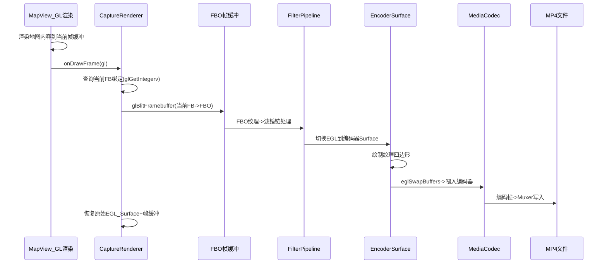
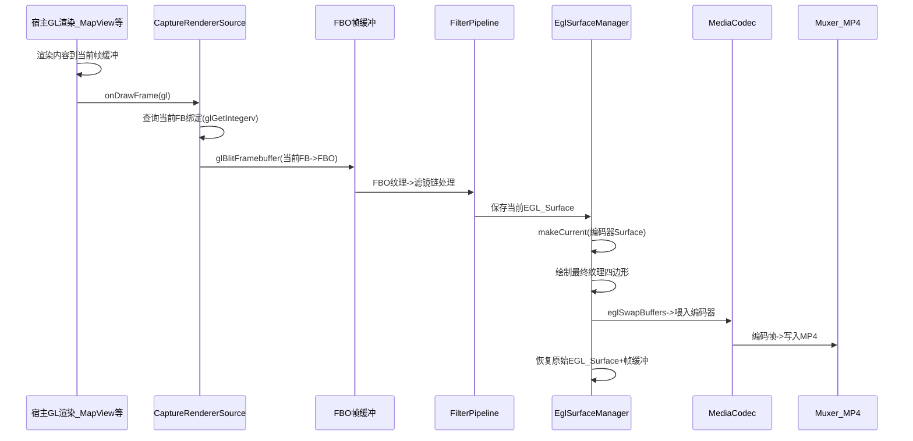
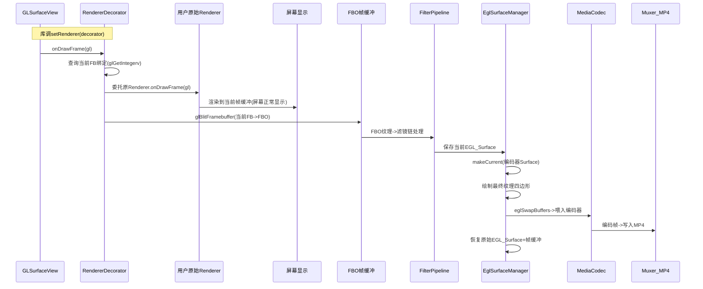
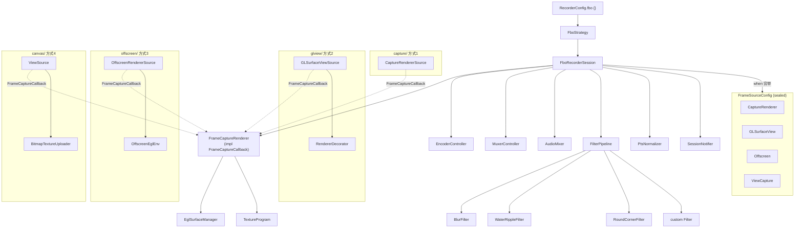

本文档为 **FBO 渲染策略** 的完整设计方案，与实现方案保持一致。库同时支持 Presentation 策略（见 IMPLEMENTATION_SUMMARY），两者均实现
RenderStrategy，由扩展函数注入。本文档用于指导实现与后续迭代。

---

# FBO 策略重构方案：解耦 MapView + 简化 DSL

---

## 零、基础知识（小白先看这篇）

**GLSurfaceView、Renderer、FBO、MediaCodec、Surface** 分别是什么？画面是怎么通过 FBO 保存成文件的？滤镜是在哪一环加上的？

👉 **已单独写成 [FBO_基础.md](FBO_基础.md)**，里面有概念解释、比喻、多张流程图和 emoji，建议先读那篇再回来看本方案。

---

## 一、核心变化

- **删除 MapSource** 及对 MapView 的一切引用，库不依赖任何地图 SDK
- **新增 CaptureRendererSource**：库提供 `GLSurfaceView.Renderer` 实现，用户自行挂载到地图或任何 GL 宿主
- **简化 DSL**：去掉 `source { session -> }` 嵌套，4 种输入模式直接写在 `fbo { }` 块内
- **Session 不再注入到 source lambda**：Session 由 `OSR.recorder()` 返回，用户在外部控制生命周期
- **Filter DSL 重构**：内置 blur / waterRipple / roundCorner 三种滤镜，支持 `custom(vararg)` 自定义扩展
- **所有模式均支持 Filter**：滤镜只影响录制视频，不影响屏幕显示
- **方式 3（renderer）纯离屏录制**：需要边看边录用方式 2（glSurfaceView）

---

## 二、MapView 与 FBO 的关系

### 2.1 地图渲染原理

MapView 内部使用 GLSurfaceView 进行 OpenGL 渲染。AMap 提供 `setCustomRenderer(CustomRenderer)` 接口，`CustomRenderer` 继承自
`GLSurfaceView.Renderer`：

```kotlin
// AMap SDK 中的 CustomRenderer
interface CustomRenderer : GLSurfaceView.Renderer {
  fun OnMapReferencechanged()
}
```

回调时序：地图完成本帧渲染后，调用 `CustomRenderer.onDrawFrame(GL10)`。此时**默认帧缓冲（ID=0）**中即为完整的地图画面。

### 2.2 FBO 帧捕获流程



### 2.3 关键技术细节

**系统要求**：OpenGL ES 3.0+（Android API 18 / 4.3+），`glBlitFramebuffer` 和 PBO 均需要 GLES 3.0。库在 `initGL` 时做运行时校验。

**在 `onDrawFrame` 回调中（同一 GL 线程，同一 GL 上下文）：**

1. **查询当前帧缓冲 + Viewport**：`glGetIntegerv(GL_FRAMEBUFFER_BINDING)` 获取当前帧缓冲 ID（**不硬编码 0**），`glGetIntegerv(GL_VIEWPORT)`
   获取实际宿主帧缓冲尺寸
2. **拷贝帧缓冲**：`glBlitFramebuffer(currentFB -> FBO)`，源矩形使用 Viewport 实际尺寸，目标使用 videoConfig 尺寸，`GL_LINEAR` 自动缩放（如
   1080x2400 -> 1080x1920）
3. **滤镜处理**（可选）：FBO 纹理经过 FilterPipeline 链式处理（blur -> waterRipple -> roundCorner -> custom...），无滤镜时短路跳过
4. **EGL 切面**：保存当前 EGL Surface，切换到编码器的 EGL Surface（同一 GL Context 即可，无需共享上下文）
5. **编码输入**：将最终纹理绘制为全屏四边形 -> `eglSwapBuffers` 喂入 MediaCodec
6. **恢复 EGL + 帧缓冲**：切换回宿主的原始 EGL Surface，恢复原始帧缓冲绑定

全程 GPU 操作，无 `glReadPixels`，无 CPU 回读，高性能。

**滤镜只影响录制视频**：屏幕上显示的是原始画面（地图/游戏/动画），FBO 拷贝后的独立纹理经过滤镜链再编码，两条路径互不干扰。

**性能注意**：`eglMakeCurrent` 切换在某些 GPU 上耗时 1-5ms。方式 3（离屏）通过 `skipEglRestore = true` 完全避免切换开销；方式 1/2 无法避免但通过缓存
display/context 减少查询。超过 8ms 的帧捕获会打 warning 日志。

---

## 三、新的 DSL 接口设计

### 3.1 FrameSourceConfig（sealed interface 替代 SourceFactory 模式）

用 Kotlin sealed interface 表达 4 种互斥的帧源配置，编译器强制 `when` 穷举，省掉 4 个 SourceFactory 类：

```kotlin
/** 帧源配置 — sealed 保证穷举，data class 只持有配置参数 */
sealed interface FrameSourceConfig {
  /** 模式A：库提供 Renderer，用户挂载到 GL 宿主（地图等） */
  data class CaptureRenderer(val attach: (GLSurfaceView.Renderer) -> Unit) : FrameSourceConfig

  /** 模式B：传入 GLSurfaceView + 用户 Renderer，边显示边录制 */
  data class GLSurfaceView(
    val surface: android.opengl.GLSurfaceView,
    val renderer: GLSurfaceView.Renderer
  ) : FrameSourceConfig

  /** 模式C：自定义 Renderer，纯离屏录制 */
  data class Offscreen(val renderer: GLSurfaceView.Renderer) : FrameSourceConfig

  /** 模式D：View 录制，Canvas -> Bitmap -> Texture */
  data class ViewCapture(val provider: () -> View) : FrameSourceConfig
}
```

### 3.2 FboConfig DSL

```kotlin
@RecorderDsl
class FboConfig {
  internal var sourceConfig: FrameSourceConfig? = null
  internal var filterConfig: FilterConfig? = null

  private fun requireSourceNotSet() {
    require(sourceConfig == null) { "只能选择一种录制模式（captureRenderer / glSurfaceView / renderer / view）" }
  }

  fun captureRenderer(attach: (GLSurfaceView.Renderer) -> Unit) {
    requireSourceNotSet()
    sourceConfig = FrameSourceConfig.CaptureRenderer(attach)
  }

  /**
   * 约束：必须在 GLSurfaceView.setRenderer() 之前调用，
   * 库内部会用装饰器包装 renderer 并调 setRenderer()。
   */
  fun glSurfaceView(surface: android.opengl.GLSurfaceView, renderer: GLSurfaceView.Renderer) {
    requireSourceNotSet()
    sourceConfig = FrameSourceConfig.GLSurfaceView(surface, renderer)
  }

  fun renderer(renderer: GLSurfaceView.Renderer) {
    requireSourceNotSet()
    sourceConfig = FrameSourceConfig.Offscreen(renderer)
  }

  fun view(provider: () -> View) {
    requireSourceNotSet()
    sourceConfig = FrameSourceConfig.ViewCapture(provider)
  }

  fun filters(block: FilterConfig.() -> Unit) {
    filterConfig = FilterConfig().apply(block)
  }
}
```

**设计原则**：

- **KISS**：sealed interface + data class 替代 4 个 SourceFactory 类，省 4 个文件
- **编译器穷举**：`when(sourceConfig)` 新增模式时编译器强制处理，不会遗漏
- **互斥校验**：`requireSourceNotSet()` 防止用户同时选多个模式
- **描述性错误**：配置缺失时抛 `RecorderError.ConfigError` 而非 `NullPointerException`

### 3.3 FilterConfig DSL（内置 + 自定义）

```kotlin
@RecorderDsl
class FilterConfig {
  internal val filters = mutableListOf<Filter>()

  /** 内置：高斯模糊 */
  fun blur(block: BlurConfig.() -> Unit = {}) {
    filters.add(BlurFilter(BlurConfig().apply(block)))
  }

  /** 内置：水波纹效果 */
  fun waterRipple(block: WaterRippleConfig.() -> Unit = {}) {
    filters.add(WaterRippleFilter(WaterRippleConfig().apply(block)))
  }

  /** 内置：圆角裁剪 */
  fun roundCorner(block: RoundCornerConfig.() -> Unit = {}) {
    filters.add(RoundCornerFilter(RoundCornerConfig().apply(block)))
  }

  /** 用户自定义滤镜（实现 Filter 接口） */
  fun custom(vararg filter: Filter) {
    filters.addAll(filter)
  }
}

/** 模糊参数 */
class BlurConfig {
  /** 模糊半径，值越大越模糊 (1~25) */
  var radius: Float = 5f
}

/** 水波纹参数 */
class WaterRippleConfig {
  /** 波浪振幅 */
  var amplitude: Float = 0.02f

  /** 波浪频率 */
  var frequency: Float = 20f

  /** 波浪速度 */
  var speed: Float = 1.0f
}

/** 圆角参数 */
class RoundCornerConfig {
  /** 圆角半径 (px) */
  var radius: Float = 16f
}
```

### 3.4 Filter 接口

```kotlin
/**
 * GL 滤镜接口。
 *
 * 线程契约：所有方法必须在 GL 线程调用（@WorkerThread）。
 * 构造函数只保存配置参数，不创建 GL 资源（构造在 DSL 配置时的 Main 线程执行）。
 * GL 资源的创建放在 init()，释放放在 release()。
 */
interface Filter {
  /** GL 初始化（编译 shader、创建内部 FBO 等） */
  @WorkerThread
  fun init(width: Int, height: Int)

  /**
   * 对输入纹理应用滤镜效果，返回输出纹理 ID。
   * 实现方自行管理内部 FBO 和输出纹理，调用方只关心输入/输出纹理 ID。
   */
  @WorkerThread
  fun apply(inputTexture: Int): Int

  /** 释放 GL 资源（内部 FBO、shader、纹理等） */
  @WorkerThread
    fun release()
}
```

**设计要点**：

- `@WorkerThread` 注解显式标注线程契约，IDE 和 lint 能检测违规调用
- 构造函数只保存配置参数（在 Main 线程执行），GL 资源在 `init()` 中创建（GL 线程执行）
- `apply` 只接收 `inputTexture`，每个 Filter 自管理内部 FBO，接口最简

### 3.5 FboStrategy + 扩展函数注入

```kotlin
// osp.osr.fbo 包，与 presentation {} 对等
fun RecorderConfig.fbo(block: FboConfig.() -> Unit) {
  val fboConfig = FboConfig().apply(block)
  renderStrategy = FboStrategy(fboConfig)
}

class FboStrategy(private val fboConfig: FboConfig) : RenderStrategy {
  override suspend fun createSession(context: Context, config: RecorderConfig): RecorderSession {
    val session = FboRecorderSession(context, config, fboConfig)
    session.prepare()
    return session
  }
}
```

---

## 四、4 种使用方式及帧捕获流程

### 方式 1：地图录制（captureRenderer）+ 滤镜

库提供 `GLSurfaceView.Renderer`，用户适配后挂载到地图。**库零地图依赖。** 屏幕显示正常地图，录制视频带滤镜。

```kotlin
lifecycleScope.launch {
    val session = OSR.recorder(context) {
      video { width = 1080; height = 1920; fps = 30 }
      output { file = File(getExternalFilesDir(null), "map.mp4") }
      audio { file = rawFile(R.raw.bgm) }
      listener { onSaved = { file -> toast("saved: $file") } }

        fbo {
          captureRenderer { frameCapture ->
            mapView.map.setCustomRenderer(frameCapture.asCustomRenderer())
          }
          filters {
            blur { radius = 3f }
            roundCorner { radius = 16f }
          }
        }
    }

  session.startRecord()
  playRouteAnimation()
  session.stopRecord()
}

// 用户 App 中的适配扩展（不在库内，无 AMap SDK 依赖）
fun GLSurfaceView.Renderer.asCustomRenderer() = object : CustomRenderer {
  override fun onDrawFrame(gl: GL10?) = this@asCustomRenderer.onDrawFrame(gl)
  override fun onSurfaceCreated(gl: GL10?, config: EGLConfig?) =
    this@asCustomRenderer.onSurfaceCreated(gl, config)
  override fun onSurfaceChanged(gl: GL10?, w: Int, h: Int) =
    this@asCustomRenderer.onSurfaceChanged(gl, w, h)
  override fun OnMapReferencechanged() {}
}
```

**方式 1 帧捕获流程：**



**特点**：帧驱动方是宿主（MapView），库被动接收 `onDrawFrame` 回调。屏幕正常显示宿主内容，录制视频经滤镜处理。帧缓冲 ID 动态查询，不硬编码。

---

### 方式 2：GLSurfaceView（边显示边录制）+ 滤镜

适用于用户自建的 GLSurfaceView（游戏、3D 场景等）。**GLSurfaceView 正常显示在屏幕上，库同时捕获帧进行录制。** 滤镜只影响录制视频。

**约束**：必须在 `GLSurfaceView.setRenderer()` 之前传给库。库会用装饰器包装用户 Renderer 并调用 `setRenderer()`。

```kotlin
// 注意：myGLSurfaceView 不要自己调 setRenderer()，交给库处理
val myGLSurfaceView = GLSurfaceView(context)
val myGameRenderer = MyGameRenderer()

lifecycleScope.launch {
  val session = OSR.recorder(context) {
    video { width = 720; height = 1280; fps = 60 }
    output { file = File(getExternalFilesDir(null), "game.mp4") }

    fbo {
      glSurfaceView(myGLSurfaceView, myGameRenderer)
      filters {
        waterRipple { amplitude = 0.03f }
        custom(MyVignetteFilter(), MyColorGradingFilter())
      }
    }
  }

  session.startRecord()
  delay(10_000)
  session.stopRecord()
}
```

**方式 2 帧捕获流程：**



**特点**：

- 库通过 `glSurfaceView(view, renderer)` 拿到未设置 Renderer 的 GLSurfaceView 和用户 Renderer
- 内部创建 `RendererDecorator` 包装用户 Renderer，然后库调 `view.setRenderer(decorator)`
- 装饰器先委托原 Renderer 渲染（屏幕正常显示），再追加 `captureFrame()`
- 帧缓冲 ID 通过 `glGetIntegerv` 动态查询，不硬编码

---

### 方式 3：自定义 Renderer（纯离屏录制）+ 滤镜

适用于纯 GL 渲染内容，**不显示在屏幕上**。库创建离屏 EGL 环境并按配置帧率驱动渲染循环。需要边看边录用方式 2。

```kotlin
lifecycleScope.launch {
  val session = OSR.recorder(context) {
    video { width = 1080; height = 1080; fps = 30 }
    output { file = File(getExternalFilesDir(null), "3d.mp4") }

    fbo {
      renderer(My3DSceneRenderer())
      filters {
        blur { radius = 2f }
        waterRipple()
        roundCorner { radius = 24f }
        custom(MyCustomFilter())
      }
    }
    }

  session.startRecord()
  delay(5_000)
  session.stopRecord()
}
```

**方式 3 帧捕获流程：**

```mermaid
sequenceDiagram
    participant Loop as 协程渲染循环
    participant UR as 用户Renderer
    participant PB as PBuffer默认帧缓冲
    participant FBO as FBO帧缓冲
    participant FP as FilterPipeline
    participant EGL as EglSurfaceManager
    participant MC as MediaCodec
    participant MX as Muxer_MP4

    Note over Loop: 库创建离屏EGL环境(PBuffer)
    Loop->>Loop: 按帧率tick(33ms@30fps)
    Loop->>EGL: makeCurrent(离屏PBuffer)
    Loop->>UR: onDrawFrame(gl)
    UR->>PB: 渲染到PBuffer默认帧缓冲
    PB->>FBO: glBlitFramebuffer(PBuffer->FBO)
    FBO->>FP: FBO纹理->滤镜链处理
    FP->>EGL: makeCurrent(编码器Surface)
    EGL->>EGL: 绘制最终纹理四边形
    EGL->>MC: eglSwapBuffers->喂入编码器
    MC->>MX: 编码帧->写入MP4
    Note over EGL: skipEglRestore=true,无需恢复PBuffer
```

**特点**：

- 帧驱动方是库的协程渲染循环，按 `videoConfig.fps` 节奏 tick
- 用户 Renderer 渲染到 PBuffer 的默认帧缓冲，然后 `glBlitFramebuffer` 拷贝到库的 FBO（与 Mode 1/2 路径一致，blit 是 GPU 操作开销极小）
- 调用 `captureFrame(skipEglRestore = true)`，跳过 EGL save/restore，每帧省 1-5ms（因为离屏环境无需恢复宿主 Surface）
- 无屏幕显示，纯后台录制

---

### 方式 4：View 录制 + 滤镜

适用于 Android View / Canvas 动画内容。

```kotlin
lifecycleScope.launch {
  val session = OSR.recorder(context) {
    video { width = 1080; height = 1920; fps = 30 }
    output { file = File(getExternalFilesDir(null), "anim.mp4") }

    fbo {
      view { AnimCircleView(context) }
      filters {
        roundCorner { radius = 20f }
      }
    }
  }

  session.startRecord()
  delay(3_000)
  session.stopRecord()
}
```

**方式 4 帧捕获流程：**

```mermaid
sequenceDiagram
    participant Loop as 协程渲染循环
    participant Main as Main线程
    participant View as AndroidView
    participant BMP as Canvas_Bitmap
    participant GL as GL线程
    participant TEX as GL纹理上传
    participant FBO as FBO帧缓冲
    participant FP as FilterPipeline
    participant EGL as EglSurfaceManager
    participant MC as MediaCodec
    participant MX as Muxer_MP4

    Loop->>Loop: 按帧率tick(33ms@30fps)
    Loop->>Main: withContext(Dispatchers.Main)
    Main->>View: view.measure+layout+draw(canvas)
    View->>BMP: Canvas绘制到Bitmap
    Main->>GL: Bitmap传递到GL线程
    GL->>TEX: glTexSubImage2D(复用纹理,更新像素)
    TEX->>FBO: 纹理绑定到FBO
    FBO->>FP: FBO纹理->滤镜链处理
    FP->>EGL: makeCurrent(编码器Surface)
    EGL->>EGL: 绘制最终纹理四边形
    EGL->>MC: eglSwapBuffers->喂入编码器
    MC->>MX: 编码帧->写入MP4
```

**特点**：

- `view.draw()` 必须在 Main 线程执行（Android View 线程安全约束），Bitmap 生成后传递到 GL 线程上传
- Bitmap + Canvas 预分配复用，避免 30fps 下每秒 ~240MB 的 GC 压力
- 首帧 `glTexImage2D` 创建纹理，后续帧 `glTexSubImage2D` 仅更新像素数据，减少 GPU 侧开销
- Canvas/Bitmap 路径涉及一次 CPU->GPU 上传，性能低于纯 GL 方式但兼容所有 Android View
- v2 可用 PBO（Pixel Buffer Object）异步化 Bitmap 上传，进一步降低 CPU 阻塞

---

## 五、Filter 系统详细设计

### 5.1 滤镜执行流水线

所有模式统一的滤镜处理流程（位于 FBO 纹理与编码器之间）：

```
帧源画面 -> FBO纹理 -> [blur] -> [waterRipple] -> [roundCorner] -> [custom...] -> 编码器 -> MP4
                  ^                                                           |
                  |                                                           |
            glBlitFramebuffer                                          eglSwapBuffers
            (从默认帧缓冲拷贝)                                        (喂入MediaCodec)
```

滤镜按 `filters { }` 中的声明顺序链式执行，每个滤镜的输出纹理是下一个的输入。无滤镜时直接编码 FBO 纹理。

### 5.2 FilterPipeline 实现

```kotlin
class FilterPipeline {
    private val filters = mutableListOf<Filter>()
  private var initialized = false

  fun isEmpty(): Boolean = filters.isEmpty()

  fun setFilters(list: List<Filter>) {
    filters.clear()
    filters.addAll(list)
    }

  fun init(width: Int, height: Int) {
    filters.forEach { it.init(width, height) }
    initialized = true
  }

  fun render(inputTexture: Int): Int {
    if (!initialized || filters.isEmpty()) return inputTexture
    var current = inputTexture
    filters.forEach { filter ->
      current = filter.apply(current)
        }
        return current
    }

  fun release() {
    filters.forEach { it.release() }
    filters.clear()
    initialized = false
  }
}
```

**变更说明**：

- `render` 去掉 `frameBuffer` 参数，与 `Filter.apply(inputTexture): Int` 对齐
- 新增 `isEmpty()` 方法，供 `FrameCaptureRenderer` 做无滤镜短路优化

### 5.3 内置滤镜实现要点

- **BlurFilter**：两趟（horizontal + vertical）高斯模糊，需要 2 个临时 FBO 做 ping-pong；radius 控制采样核大小
- **WaterRippleFilter**：fragment shader 中 `uv.y += sin(uv.x * frequency + time * speed) * amplitude`，需传入时间 uniform。时间来源：Filter
  在 `init()` 中记录 `startTimeNs = System.nanoTime()`，`apply()` 中计算 `timeSec = (System.nanoTime() - startTimeNs) / 1e9f`，通过
  uniform 传入 shader。这保持了 Filter 接口的简洁性（无需外部注入 time）。
- **RoundCornerFilter**：fragment shader 中根据 uv 到四角的距离做 alpha 裁剪（`smoothstep` 抗锯齿）

### 5.4 滤镜对各模式的影响

| 模式                   | 屏幕显示                     | 录制视频  |
|----------------------|--------------------------|-------|
| 方式 1 captureRenderer | 原始画面（地图正常可见）             | 带滤镜效果 |
| 方式 2 glSurfaceView   | 原始画面（GLSurfaceView 正常显示） | 带滤镜效果 |
| 方式 3 renderer        | 无显示（纯离屏）                 | 带滤镜效果 |
| 方式 4 view            | 无显示（离屏 Canvas）           | 带滤镜效果 |

---

## 六、内部模块结构

### 6.1 FBO 包结构

相比初版优化：sealed interface 替代 4 个 SourceFactory，Filter + FilterPipeline 合并，新增 core/util 公共类。总文件数从 22 个精简到 **18 个
**。

```
osp.osr.core.util/                      // 公共工具（DRY：与 Presentation 策略共享）
 +-- PtsNormalizer.kt                   //   PTS 归零器
 +-- SessionNotifier.kt                 //   Listener 通知器

osp.osr.fbo/
 |
 +-- FboConfig.kt                       // FBO DSL 配置 + FrameSourceConfig sealed interface + FilterConfig
 +-- FboStrategy.kt                     // RenderStrategy 实现 + RecorderConfig.fbo {} 扩展
 +-- FboRecorderSession.kt              // RecorderSession 实现
 +-- FrameSource.kt                     // FrameSource 接口 + FrameCaptureCallback 接口
 |
 +-- capture/                           // 方式1: captureRenderer（GL帧捕获）
 |    +-- CaptureRendererSource.kt      //   FrameSource 实现
 |
 +-- glview/                            // 方式2: glSurfaceView（边显示边录制）
 |    +-- GLSurfaceViewSource.kt        //   FrameSource 实现
 |    +-- RendererDecorator.kt          //   Renderer 装饰器
 |
 +-- offscreen/                         // 方式3: renderer（纯离屏录制）
 |    +-- OffscreenRendererSource.kt    //   FrameSource 实现
 |    +-- OffscreenEglEnv.kt            //   离屏 EGL 环境（PBuffer）
 |
 +-- canvas/                            // 方式4: view（Canvas 录制）
 |    +-- ViewSource.kt                 //   FrameSource 实现
 |    +-- BitmapTextureUploader.kt      //   Bitmap -> GL Texture 管理
 |
 +-- filter/                            // 滤镜系统（公共，所有模式共享）
 |    +-- Filter.kt                     //   滤镜接口 + FilterPipeline（合并，内聚）
 |    +-- BlurFilter.kt                 //   内置：高斯模糊
 |    +-- WaterRippleFilter.kt          //   内置：水波纹
 |    +-- RoundCornerFilter.kt          //   内置：圆角裁剪
 |
 +-- gl/                                // GL 工具（公共，所有模式共享）
      +-- EglHelper.kt                  //   EGL 上下文/Surface 工具
      +-- EglSurfaceManager.kt          //   编码器 EGL Surface 管理
      +-- FrameCaptureRenderer.kt       //   核心：帧捕获 + 实现 FrameCaptureCallback
      +-- TextureProgram.kt             //   全屏纹理四边形着色器
```

**与初版对比**：

- 省掉 4 个 SourceFactory 文件（sealed interface 替代）
- Filter.kt + FilterPipeline.kt 合并为 1 个文件（接口和管理类高内聚）
- 新增 core/util 包 2 个文件（PtsNormalizer、SessionNotifier，两个 Session 共享）
- FrameSourceConfig 放入 FboConfig.kt（sealed interface 很短，不需要独立文件）
- FrameCaptureCallback 放入 FrameSource.kt（与 FrameSource 接口同文件）

**包职责划分**：

- `core/util/`：跨策略共享工具（PTS 归零、Listener 通知）
- `fbo/` 根：FBO 策略公共部分（配置、策略入口、Session、帧源接口）
- `capture/`、`glview/`、`offscreen/`、`canvas/`：各模式独立实现，互不依赖
- `filter/`：滤镜系统，所有模式共享
- `gl/`：GL 工具 + 帧捕获核心，所有模式共享

### 6.2 核心类关系



### 6.3 FrameSource 接口 + FrameCaptureCallback（依赖倒置）

```kotlin
package osp.osr.fbo

/**
 * 帧捕获回调接口 — FrameSource 依赖此抽象，不依赖 FrameCaptureRenderer 具体类。
 * 解耦后 FrameSource 可独立测试（传入 mock callback）。
 */
interface FrameCaptureCallback {
  /** GL 环境就绪时调用，FrameSource 负责在 onSurfaceCreated 中调此方法 */
  fun onGLReady(display: EGLDisplay, context: EGLContext)

  /** 每帧调用，执行帧捕获 + 滤镜 + 编码 */
  fun onFrameAvailable(skipEglRestore: Boolean = false)
}

interface FrameSource {
  /** 初始化并开始帧捕获，绑定回调 */
  fun start(callback: FrameCaptureCallback)

  /** 停止帧捕获，释放资源 */
  fun stop()
}
```

`FrameCaptureRenderer` 实现 `FrameCaptureCallback`：
```kotlin
class FrameCaptureRenderer(...) : FrameCaptureCallback {
  override fun onGLReady(display: EGLDisplay, context: EGLContext) = initGL(display, context)
  override fun onFrameAvailable(skipEglRestore: Boolean) = captureFrame(skipEglRestore)
}
```

**设计原则**：

- **DIP（依赖倒置）**：FrameSource 只依赖 `FrameCaptureCallback` 抽象
- **显式契约**：`onGLReady` 明确了 GL 初始化时机由 FrameSource 触发，消除了"谁调 initGL"的隐晦约定
- **可测试性**：可传入 mock callback 独立测试 FrameSource

### 6.4 各模式 FrameSource 实现

**capture/ — CaptureRendererSource（方式 1）**

库创建 `GLSurfaceView.Renderer`，用户通过 lambda 挂载到宿主（MapView 等）。宿主每帧调 `onDrawFrame` -> 库调 `callback.onFrameAvailable()`。
`onSurfaceCreated` 中调 `callback.onGLReady(display, context)` 完成 GL 初始化。

**glview/ — GLSurfaceViewSource（方式 2）**

库用 `RendererDecorator` 包装用户传入的 Renderer，再调 `GLSurfaceView.setRenderer(decorator)`。装饰器先委托原 Renderer 渲染（屏幕正常显示），再追加
`callback.onFrameAvailable()`。用户无感知，边看边录。

**约束**：用户不能自己调 `setRenderer()`，必须在调用前把 GLSurfaceView 和 Renderer 一起传给库。`GLSurfaceViewSource.start(callback)` 内部调用
`view.setRenderer(RendererDecorator(userRenderer, callback))`。

**offscreen/ — OffscreenRendererSource（方式 3）**

库通过 `OffscreenEglEnv` 创建离屏 EGL 环境（PBuffer Surface），`start()` 时调 `callback.onGLReady()` 初始化 GL。协程循环按 `videoConfig.fps`
帧率驱动用户 Renderer 的 `onDrawFrame`。用户 Renderer 渲染到 PBuffer 的默认帧缓冲，然后 `callback.onFrameAvailable(skipEglRestore = true)`
统一走 `glBlitFramebuffer` 拷贝到库的 FBO（blit 是 GPU 操作，开销极小）。纯后台，不显示。`skipEglRestore = true` 省去 EGL save/restore 开销。

**canvas/ — ViewSource（方式 4）**

分两阶段执行：

- **Main 线程**：`withContext(Dispatchers.Main)` 中调 `view.measure(MeasureSpec.makeMeasureSpec(width, EXACTLY), ...)` +`view.layout()` +
  `view.draw(canvas)` -> Bitmap（保证 View 线程安全）
- **GL 线程**：`BitmapTextureUploader.upload()` -> FBO 纹理 -> 滤镜 -> 编码

**性能关键**：Bitmap + Canvas 预分配复用，避免每帧 GC：
```kotlin
// ViewSource 初始化时一次性创建
private val bitmap = Bitmap.createBitmap(width, height, Bitmap.Config.ARGB_8888)
private val canvas = Canvas(bitmap)

// 每帧复用
canvas.drawColor(Color.TRANSPARENT, PorterDuff.Mode.CLEAR)
view.draw(canvas)
uploader.upload(bitmap)  // 首帧 glTexImage2D 创建纹理，后续帧 glTexSubImage2D 更新
```

`BitmapTextureUploader` 首帧用 `glTexImage2D` 分配 GPU 纹理，后续帧用 `glTexSubImage2D` 仅更新像素数据，避免重复创建纹理。

ViewSource 内部需创建 `OffscreenEglEnv`（与 Mode 3 共享实现）作为 GL 线程环境。

---

## 七、FrameCaptureRenderer 核心逻辑

```kotlin
/**
 * 核心帧捕获渲染器，同时实现 FrameCaptureCallback 供 FrameSource 回调。
 *
 * ISP：只接收 width/height，不依赖整个 VideoConfig。
 * 线程模型：所有方法在 GL 线程调用，startCapture/stopCapture/release 除外（Session 线程）。
 */
class FrameCaptureRenderer(
  private val width: Int,
  private val height: Int,
  private val filterPipeline: FilterPipeline,
  private val encoderSurface: Surface
) : FrameCaptureCallback {

  private var fboId = 0
  private var fboTextureId = 0
  private lateinit var eglManager: EglSurfaceManager
  private lateinit var textureProgram: TextureProgram

  /** @Volatile：Session 线程写，GL 线程读，保证跨线程可见性 */
  @Volatile
  private var recording = false
  @Volatile
  private var initialized = false

  // ── FrameCaptureCallback 实现 ──

  override fun onGLReady(display: EGLDisplay, context: EGLContext) = initGL(display, context)
  override fun onFrameAvailable(skipEglRestore: Boolean) = captureFrame(skipEglRestore)

  // ── GL 线程方法 ──

  private fun initGL(eglDisplay: EGLDisplay, eglContext: EGLContext) {
    val version = IntArray(2)
    GLES30.glGetIntegerv(GLES30.GL_MAJOR_VERSION, version, 0)
    require(version[0] >= 3) { "FBO 策略需要 OpenGL ES 3.0+，当前 ${version[0]}.${version[1]}" }

    createFbo(width, height)
    eglManager = EglSurfaceManager(eglDisplay, eglContext, encoderSurface)
    textureProgram = TextureProgram()
    filterPipeline.init(width, height)
    initialized = true
  }

  private fun captureFrame(skipEglRestore: Boolean = false) {
    if (!recording || !initialized) return
    val startNs = System.nanoTime()

    // Step 1: 查询并保存当前帧缓冲绑定 + Viewport 尺寸
    val savedFbo = IntArray(1)
    GLES30.glGetIntegerv(GLES30.GL_FRAMEBUFFER_BINDING, savedFbo, 0)
    val viewport = IntArray(4)
    GLES30.glGetIntegerv(GLES30.GL_VIEWPORT, viewport, 0)

    // Step 2: 拷贝当前帧缓冲到 FBO（源尺寸 = Viewport，目标 = 视频尺寸，GL_LINEAR 自动缩放）
    GLES30.glBindFramebuffer(GLES30.GL_READ_FRAMEBUFFER, savedFbo[0])
    GLES30.glBindFramebuffer(GLES30.GL_DRAW_FRAMEBUFFER, fboId)
    GLES30.glBlitFramebuffer(
      0, 0, viewport[2], viewport[3],
      0, 0, width, height,
      GLES30.GL_COLOR_BUFFER_BIT, GLES30.GL_LINEAR
    )

    // Step 3: 滤镜链处理（无滤镜时短路）
    val outputTexture = if (filterPipeline.isEmpty()) fboTextureId
    else filterPipeline.render(fboTextureId)

    // Step 4: 保存当前 EGL Surface（离屏模式可跳过）
    var savedReadSurface: android.opengl.EGLSurface? = null
    var savedDrawSurface: android.opengl.EGLSurface? = null
    if (!skipEglRestore) {
      savedReadSurface = EGL14.eglGetCurrentSurface(EGL14.EGL_READ)
      savedDrawSurface = EGL14.eglGetCurrentSurface(EGL14.EGL_DRAW)
    }

    // Step 5-6: 切换到编码器 Surface，绘制编码。try/finally 保证异常时恢复宿主 EGL。
    try {
      eglManager.makeCurrent()
      GLES30.glViewport(0, 0, width, height)
      textureProgram.draw(outputTexture)
      eglManager.swapBuffers()
    } finally {
      if (!skipEglRestore) {
        EGL14.eglMakeCurrent(
          eglManager.display, savedDrawSurface, savedReadSurface,
          EGL14.eglGetCurrentContext()
        )
        GLES30.glBindFramebuffer(GLES30.GL_FRAMEBUFFER, savedFbo[0])
      }
    }

    val elapsedMs = (System.nanoTime() - startNs) / 1_000_000f
    if (elapsedMs > 8f) {
      OsrLog.w("captureFrame took %.1fms, may cause jank on host".format(elapsedMs))
    }
  }

  // ── Session 线程方法 ──

  fun startCapture() {
    recording = true
  }
  fun stopCapture() {
    recording = false
  }

  /** 防重入：已释放或从未初始化时直接返回，每步 runCatching 防止连锁失败 */
  fun release() {
    if (!initialized) return
    initialized = false
    recording = false
    runCatching { filterPipeline.release() }
    runCatching { textureProgram.release() }
    runCatching { eglManager.release() }
    runCatching { deleteFbo() }
  }
}
```

**设计原则**：

1. **ISP（接口隔离）**：构造参数 `width/height` 替代 `VideoConfig`，只取所需
2. **DIP（依赖倒置）**：实现 `FrameCaptureCallback` 接口，FrameSource 不依赖此具体类
3. **`@Volatile`**：`recording` / `initialized` 跨线程读写，保证可见性
4. **防重入 release**：`if (!initialized) return` 防止重复释放，`runCatching` 防连锁失败
5. **try/finally**：EGL 切换异常安全
6. **Viewport 动态查询**：源矩形 = 宿主实际尺寸，自动缩放到视频尺寸

---

## 八、FboRecorderSession 编排逻辑

`FboRecorderSession` 实现 `RecorderSession`，负责编排整个录制生命周期。

**DRY 提取**：PTS 归零和 Listener 通知逻辑与 `PresentationRecorderSession` 共享，提取到公共工具类：

```kotlin
// osp.osr.core.util 包 — 两个 Session 共享

/** PTS 归零器：记录首帧基准，后续帧减去基准得到相对时间 */
internal class PtsNormalizer {
  private var firstPts = -1L
  var lastPts = 0L; private set

  fun normalize(info: MediaCodec.BufferInfo) {
    val raw = info.presentationTimeUs
    if (firstPts < 0) firstPts = raw
    val normalized = raw - firstPts
    info.presentationTimeUs = normalized
    lastPts = normalized
  }
}

/** Listener 通知器：统一 try-catch，防止用户回调异常传播 */
internal class SessionNotifier(private val listener: ListenerConfig) {
  fun notifyStart() {
    runCatching { listener.onStart?.invoke() }
  }
  fun notifyStop() {
    runCatching { listener.onStop?.invoke() }
  }
  fun notifySaved(file: File) {
    runCatching { listener.onSaved?.invoke(file) }
  }
  fun notifyError(error: RecorderError) {
    runCatching { listener.onError?.invoke(error) }
  }
}
```

**FboRecorderSession 实现**：

```kotlin
internal class FboRecorderSession(
  context: Context,
  private val config: RecorderConfig,
  private val fboConfig: FboConfig
) : RecorderSession {

  private val state = AtomicReference(RecorderState.IDLE)
  private val recorderScope = CoroutineScope(SupervisorJob() + Dispatchers.Default)

  private val encoderController = EncoderController(config.videoConfig)
  private val muxerController = MuxerController(
    config.outputConfig.file ?: throw RecorderError.MuxerError("未设置输出文件")
  )
  private val audioMixer: AudioMixer? = config.audioConfig.file?.let { AudioMixer(it, muxerController) }

  private val filterPipeline = FilterPipeline()
  private lateinit var captureRenderer: FrameCaptureRenderer
  private lateinit var frameSource: FrameSource

  private val ptsNormalizer = PtsNormalizer()       // DRY：与 PresentationRecorderSession 共享
  private val notifier = SessionNotifier(config.listenerConfig)  // DRY：统一通知

  suspend fun prepare() {
    checkAndTransition(RecorderState.IDLE, RecorderState.PREPARED)

    try {
      val encoderSurface = encoderController.prepare()
      muxerController.prepare()
      audioMixer?.prepare()

      fboConfig.filterConfig?.let { filterPipeline.setFilters(it.filters) }

      captureRenderer = FrameCaptureRenderer(
        config.videoConfig.width, config.videoConfig.height,  // ISP：只传 width/height
        filterPipeline, encoderSurface
      )

      // sealed when 穷举创建 FrameSource（描述性错误替代 !!）
      val sourceConfig = fboConfig.sourceConfig
        ?: throw RecorderError.ConfigError("必须在 fbo {} 中选择一种录制模式")
      frameSource = createFrameSource(sourceConfig)
      frameSource.start(captureRenderer)  // captureRenderer 实现 FrameCaptureCallback
    } catch (e: Exception) {
      state.set(RecorderState.RELEASED)
      releaseResources()
      notifier.notifyError(wrapError(e))
      throw e
    }
  }

  /** sealed when 穷举：新增模式编译器强制处理 */
  private fun createFrameSource(config: FrameSourceConfig): FrameSource = when (config) {
    is FrameSourceConfig.CaptureRenderer -> CaptureRendererSource(config.attach)
    is FrameSourceConfig.GLSurfaceView -> GLSurfaceViewSource(config.surface, config.renderer)
    is FrameSourceConfig.Offscreen -> OffscreenRendererSource(config.renderer)
    is FrameSourceConfig.ViewCapture -> ViewSource(config.provider)
  }

  override fun startRecord() {
    checkAndTransition(RecorderState.PREPARED, RecorderState.RECORDING)

    try {
      captureRenderer.startCapture()
      encoderController.start()
      encoderController.launchEncoderLoop(
        scope = recorderScope,
        onFormatChanged = { format ->
          muxerController.addVideoTrack(format)
          muxerController.start()
          audioMixer?.startMixing(recorderScope)
        },
        onFrame = { buffer, info ->
          ptsNormalizer.normalize(info)  // DRY：一行调用替代 6 行重复逻辑
          muxerController.writeSampleData(
            muxerController.getVideoTrackIndex(), buffer, info
          )
        }
      )
      notifier.notifyStart()
    } catch (e: Exception) {
      state.set(RecorderState.RELEASED)
      releaseResources()
      notifier.notifyError(wrapError(e))
      throw e
    }
  }

  override fun stopRecord() {
    checkAndTransition(RecorderState.RECORDING, RecorderState.STOPPING)
    captureRenderer.stopCapture()

    recorderScope.launch {
      try {
        encoderController.signalEndOfStream()
        encoderController.done.await()
        audioMixer?.stopMixing()
        muxerController.stop()

        notifier.notifyStop()
        config.outputConfig.file?.let { notifier.notifySaved(it) }
      } catch (e: Exception) {
        notifier.notifyError(wrapError(e))
      } finally {
        state.set(RecorderState.RELEASED)
        releaseResources()
      }
    }
  }

  override fun release() {
    val prev = state.getAndSet(RecorderState.RELEASED)
    if (prev == RecorderState.RELEASED) return
    releaseResources()
  }

  override fun getState() = state.get()

  /** 每步 runCatching：一个组件释放失败不阻止其余组件释放 */
  private fun releaseResources() {
    runCatching { frameSource.stop() }
    runCatching { captureRenderer.release() }
    runCatching { encoderController.release() }
    runCatching { audioMixer?.release() }
    runCatching { muxerController.release() }
    recorderScope.cancel()
  }

  private fun checkAndTransition(expected: RecorderState, next: RecorderState) {
    if (!state.compareAndSet(expected, next)) {
      throw RecorderError.EncoderError("非法状态转换: 期望 $expected, 实际 ${state.get()}")
    }
  }

  private fun wrapError(e: Exception): RecorderError =
    if (e is RecorderError) e else RecorderError.EncoderError("录制异常", e)
}
```

---

## 九、与 Presentation 策略的对比

| 维度     | Presentation 策略                        | FBO 策略                                                      |
|--------|----------------------------------------|-------------------------------------------------------------|
| 系统依赖   | MediaProjection + VirtualDisplay       | OpenGL ES 3.0+                                              |
| 帧来源    | Presentation 渲染到 VirtualDisplay        | GL 帧捕获 / View Canvas                                        |
| 地图支持   | 持有 MapView 引用                          | 不持有，通过 Renderer 回调                                          |
| 性能     | Display 投射                             | GPU 直捕，更高效                                                  |
| 权限     | 可能需要 MediaProjection 权限                | 无需任何权限                                                      |
| 滤镜     | 不支持                                    | 支持（内置 + 自定义）                                                |
| 边看边录   | 不支持（Presentation 在独立 Display）          | 方式 1/2 支持                                                   |
| DSL 入口 | `presentation { display, session -> }` | `fbo { captureRenderer / glSurfaceView / renderer / view }` |

---

## 十、4 种模式横向对比

| 模式      | DSL 关键字                         | 输入                          | 帧驱动方    | 屏幕显示               | Filter | 典型场景           |
|---------|---------------------------------|-----------------------------|---------|--------------------|--------|----------------|
| 地图录制    | `captureRenderer {}`            | 库输出 Renderer，用户挂载           | 宿主      | 宿主自行显示             | 仅录制    | 高德/Google 地图轨迹 |
| GL 控件   | `glSurfaceView(view, renderer)` | 传入 GLSurfaceView + Renderer | 宿主      | GLSurfaceView 正常显示 | 仅录制    | 游戏、3D 场景       |
| 离屏渲染    | `renderer()`                    | 传入 Renderer 实现              | 库（协程循环） | 不显示                | 仅录制    | 纯 GL 动画生成      |
| View 录制 | `view {}`                       | 传入 View                     | 库（协程循环） | 不显示                | 仅录制    | Canvas 动画      |

---

## 十一、需变更的文件

### 新增文件（18 个）

**core/util（公共工具，DRY 共享）：**

- `osc/src/main/kotlin/osp/osr/core/util/PtsNormalizer.kt` - PTS 归零器
- `osc/src/main/kotlin/osp/osr/core/util/SessionNotifier.kt` - Listener 通知器

**fbo 包根（公共）：**

- `osc/src/main/kotlin/osp/osr/fbo/FboConfig.kt` - FboConfig DSL + FrameSourceConfig sealed interface + FilterConfig
- `osc/src/main/kotlin/osp/osr/fbo/FboStrategy.kt` - RenderStrategy 实现 + `RecorderConfig.fbo {}` 扩展
- `osc/src/main/kotlin/osp/osr/fbo/FboRecorderSession.kt` - Session 实现
- `osc/src/main/kotlin/osp/osr/fbo/FrameSource.kt` - FrameSource 接口 + FrameCaptureCallback 接口

**capture/（方式 1）：**

- `osc/src/main/kotlin/osp/osr/fbo/capture/CaptureRendererSource.kt`

**glview/（方式 2）：**

- `osc/src/main/kotlin/osp/osr/fbo/glview/GLSurfaceViewSource.kt`
- `osc/src/main/kotlin/osp/osr/fbo/glview/RendererDecorator.kt`

**offscreen/（方式 3）：**

- `osc/src/main/kotlin/osp/osr/fbo/offscreen/OffscreenRendererSource.kt`
- `osc/src/main/kotlin/osp/osr/fbo/offscreen/OffscreenEglEnv.kt`

**canvas/（方式 4）：**

- `osc/src/main/kotlin/osp/osr/fbo/canvas/ViewSource.kt`
- `osc/src/main/kotlin/osp/osr/fbo/canvas/BitmapTextureUploader.kt`

**filter/（滤镜系统）：**

- `osc/src/main/kotlin/osp/osr/fbo/filter/Filter.kt` - Filter 接口 + FilterPipeline（合并，高内聚）
- `osc/src/main/kotlin/osp/osr/fbo/filter/BlurFilter.kt`
- `osc/src/main/kotlin/osp/osr/fbo/filter/WaterRippleFilter.kt`
- `osc/src/main/kotlin/osp/osr/fbo/filter/RoundCornerFilter.kt`

**gl/（GL 工具）：**

- `osc/src/main/kotlin/osp/osr/fbo/gl/EglHelper.kt`
- `osc/src/main/kotlin/osp/osr/fbo/gl/EglSurfaceManager.kt`
- `osc/src/main/kotlin/osp/osr/fbo/gl/FrameCaptureRenderer.kt` - 实现 FrameCaptureCallback
- `osc/src/main/kotlin/osp/osr/fbo/gl/TextureProgram.kt`

### 修改文件

- `FBO.md` - 替换为本方案全文
- `osc/src/main/kotlin/osp/osr/pres/PresentationRecorderSession.kt` - 改用 `PtsNormalizer` + `SessionNotifier`（可选，DRY 重构）

### 不变

- 公共层（RecorderConfig、RecorderSession、RenderStrategy、EncoderController、MuxerController、AudioMixer 等）**不需要任何修改**，FBO 策略通过扩展函数注入

---

## 十二、技术约束与注意事项

### 12.1 系统要求

- **OpenGL ES 3.0+**（Android API 18 / 4.3+）：`glBlitFramebuffer` 和 PBO 均需要 GLES 3.0
- 库在 `FrameCaptureRenderer.initGL()` 中做运行时校验，不满足时抛出明确异常

### 12.2 方式 2 的 setRenderer 约束

- Android `GLSurfaceView.setRenderer()` **只能调一次**，调用后不可更换
- 用户必须在调 `setRenderer()` 之前把 GLSurfaceView 和 Renderer 传给库
- 库内部通过 `RendererDecorator` 包装后调用 `setRenderer()`
- DSL：`glSurfaceView(view, renderer)` 而非 `glSurfaceView(view)`

### 12.3 默认帧缓冲 ID + Viewport

- **不硬编码 0**：某些 GPU（Mali 等）或 SDK 内部可能使用非 0 的帧缓冲
- 在 `captureFrame()` 进入时用 `glGetIntegerv(GL_FRAMEBUFFER_BINDING)` 查询当前帧缓冲 ID
- 同时用 `glGetIntegerv(GL_VIEWPORT)` 查询实际帧缓冲尺寸作为 `glBlitFramebuffer` 的源矩形
- `glBlitFramebuffer` 源/目标尺寸不同时，`GL_LINEAR` 自动缩放（如 1080x2400 屏幕 -> 1080x1920 视频）
- 捕获完成后恢复到查询到的原始帧缓冲 ID

### 12.4 方式 4 线程安全

- Android View 的 `measure()` / `layout()` / `draw()` 需在 Main 线程调用
- `measure()` 使用 `MeasureSpec.makeMeasureSpec(width, EXACTLY)` 指定精确尺寸
- ViewSource 分两阶段：Main 线程生成 Bitmap -> GL 线程上传纹理并编码
- 通过 `withContext(Dispatchers.Main)` 确保 View 操作在正确线程

### 12.5 GL 初始化竞态防护

- Mode 1/2 中，`initGL()` 在宿主的 `onSurfaceCreated` 回调中执行，但用户可能在 GL Surface 就绪前就调 `startRecord()`
- `FrameCaptureRenderer` 通过 `initialized` 标志防护：`captureFrame()` 入口检查 `if (!recording || !initialized) return`
- `release()` 时设 `initialized = false`，宿主继续回调 `onDrawFrame` 时安全短路，不访问已释放的 GL 资源

### 12.6 EGL 切换异常安全

- `captureFrame()` 中 EGL 切面（save -> makeCurrent -> draw -> swap -> restore）用 `try/finally` 包裹
- 即使 `textureProgram.draw()` 或 `eglSwapBuffers()` 抛异常，`finally` 块也会恢复宿主的 EGL Surface
- 防止宿主渲染被污染（画面输出到编码器 Surface 导致屏幕黑屏）

### 12.7 PTS 归零

- 编码器输出的 pts 是系统单调时钟的绝对值，直接写入 MP4 会导致播放器异常
- 抽取公共 `PtsNormalizer` 类：记录首帧 pts 作为基准，后续帧减去基准得到相对时间
- `FboRecorderSession` 和 `PresentationRecorderSession` 共享同一 `PtsNormalizer`（DRY）

---

## 十三、性能优化要点

### 已在 v1 中实现的优化

| 优化项                              | 适用模式   | 效果                            |
|----------------------------------|--------|-------------------------------|
| `skipEglRestore = true`          | 方式 3/4 | 每帧省 1-5ms EGL 切换              |
| 无滤镜短路 `filterPipeline.isEmpty()` | 全部     | 无滤镜时跳过滤镜链空跑                   |
| 帧缓冲 ID + Viewport 动态查询           | 方式 1/2 | 兼容性保障 + 自动缩放，避免黑屏/裁剪          |
| 帧耗时监控                            | 全部     | 超 8ms 打 warning，辅助调试          |
| `initialized` 防护                 | 方式 1/2 | 竞态安全 + 释放后安全                  |
| EGL try/finally                  | 方式 1/2 | 异常时恢复宿主 EGL，防止渲染污染            |
| Bitmap + Canvas 预分配复用            | 方式 4   | 避免每帧 GC（30fps 下省 ~240MB/s 分配） |
| `glTexSubImage2D` 更新纹理           | 方式 4   | 复用 GPU 纹理对象，避免每帧重建            |
| PTS 归零                           | 全部     | 保证 MP4 播放和音视频对齐正确             |

### v2 可选优化（不阻塞 v1 交付）

| 优化项                  | 适用模式   | 预期效果                      |
|----------------------|--------|---------------------------|
| PBO 双缓冲异步 Bitmap 上传  | 方式 4   | CPU->GPU 传输吞吐提升 2-3 倍     |
| 编码器 Surface 独立 GL 线程 | 方式 1/2 | 解耦宿主帧率和编码延迟               |
| Filter 内部 FBO 复用池    | 多滤镜场景  | 减少 FBO 创建/销毁开销            |
| Viewport/FB ID 缓存    | 方式 1/2 | 减少每帧 2 次 glGetIntegerv 调用 |

---

## 十四、编码最佳实践适用总结

本方案在设计和代码中遵循的工程原则：

| 原则             | 应用点                                                                        | 效果                |
|----------------|----------------------------------------------------------------------------|-------------------|
| **SRP**        | 每个 FrameSource 只负责一种帧源；PtsNormalizer / SessionNotifier 单一职责                | 类职责清晰，易维护         |
| **OCP**        | Filter 接口 + `custom()` 扩展点；RenderStrategy 扩展函数注入                           | 新增滤镜/策略无需改现有代码    |
| **LSP**        | 4 种 FrameSource 均可替换使用，行为一致                                                | Session 不关心具体帧源类型 |
| **ISP**        | FrameCaptureRenderer 只接收 width/height，不依赖整个 VideoConfig                    | 减少不必要耦合           |
| **DIP**        | FrameSource 依赖 FrameCaptureCallback 接口，不依赖 FrameCaptureRenderer 具体类        | 解耦 + 可测试          |
| **DRY**        | PtsNormalizer / SessionNotifier 两个 Session 共享                              | 逻辑修一处即可           |
| **KISS**       | sealed interface 替代 4 个 SourceFactory 类                                    | 省 4 个文件，编译器穷举     |
| **防御性编程**      | `@Volatile` 线程安全；`runCatching` 释放容错；`try/finally` EGL 保护；`initialized` 防竞态 | 健壮性               |
| **Kotlin 惯用法** | sealed interface + when 穷举；data class 配置；runCatching；`@RecorderDsl`        | 代码简洁、类型安全         |

---

## 十五、FBO 代码注释规范与总结

FBO 包下（含 `gl/`、`filter/`、`source/`）已按「小白友好、活泼、带 emoji」补充详细注释，重点说明**为什么这么做**以及**代码/数据流转到类+方法**
。以下为注释总结，便于维护与续写时保持一致风格。

### 15.1 注释风格约定

- **语气**：口语化（如「干啥的」「谁调我」「之后发生啥」），可用 emoji（🛠️ 📸 🎬 🖼️ 🔗 📌 🌫️ 🌊 📐 等）。
- **必写内容**：
  - 类/方法职责（一句话 + 可选「谁调我 / 谁用」）；
  - 关键步骤的**原因**（为什么用 FBO、为什么两趟模糊、为什么保存 EGL 等）；
  - **数据流**：做完这一步后，**哪个类、哪个方法**会执行（到类+方法级别），便于顺调用链阅读。

### 15.2 gl 包注释要点（最详细）

| 文件                    | 类/方法注释要点                                                                                                                                                          |
|-----------------------|-------------------------------------------------------------------------------------------------------------------------------------------------------------------|
| **GlUtil**            | 三大职责（编译 shader/program、创建 FBO+纹理、画全屏四边形）；`createProgram` / `createFboWithTexture` / `drawTexture` 的流程、返回含义、**谁调我**、**之后发生啥**（GPU 执行到哪、写到哪）；四边形顶点与 FloatBuffer 用途。 |
| **EglHelper**         | EGL 是什么、为何要离屏；**数据流**（谁创建、init 后谁 makeCurrent、典型调用顺序）；`init` 为何要 GLES3、`createPbufferSurface` 时机、`makeCurrent` 之后绘制目标、`release` 谁调。                               |
| **EglSurfaceManager** | 与 EglHelper 的区别；**数据流**（谁造、makeCurrent/swapBuffers 作用）；**典型一帧流程**（步骤 1–4，到类+方法）。                                                                                  |
| **TextureProgram**    | 在管线中的角色（最后一步：滤镜输出 → 编码器 Surface）；**数据流**（谁造、谁调 draw、draw 内部到 GlUtil）；shader 在做什么。                                                                                 |

### 15.3 其他 FBO 文件注释要点

| 文件/模块                                                  | 注释要点                                                                                                        |
|--------------------------------------------------------|-------------------------------------------------------------------------------------------------------------|
| **FrameCaptureRenderer**                               | 类注释：一整帧的**数据流（类+方法）**（从 FrameSource 调 `captureFrame()` 到 finally 恢复宿主）；`initGL` / `captureFrame` 的谁调、之后谁执行。 |
| **FboConfig / FboStrategy**                            | FrameSourceConfig 四种模式各一句话 + 谁用；FboStrategy 谁调、createSession 后的数据流。                                         |
| **FboRecorderSession**                                 | 类注释：**数据流简图**（从 OSR.recorder 到 onFrame 写 Muxer）；prepare / startRecord / stopRecord 中关键步骤的「谁调、之后哪个类/方法执行」。   |
| **Filter / FilterPipeline**                            | 接口职责、数据流（init/apply/release 谁调）、管线链式执行说明。                                                                   |
| **FrameSource / FrameCaptureCallback**                 | 帧源概念、四种实现、依赖倒置。                                                                                             |
| **四种 FrameSource 实现**                                  | 每种「小白一句话」+ **数据流**（到类+方法）；关键回调（如 onDrawFrame）里注明「此时谁被调、画面到哪」。                                               |
| **BlurFilter / WaterRippleFilter / RoundCornerFilter** | 为何两趟模糊、水波纹/圆角思路、**数据流**（apply 输入 → uniform → 片元 → 输出纹理）。                                                    |

### 15.4 维护建议

- 新增 gl 包类/方法：按 15.2 的粒度补全「谁调 / 谁用 / 之后谁执行」。
- 新增 Filter 或 FrameSource：在类注释里写清「小白一句话」+ 数据流（到类+方法）。
- 修改管线或调用链时，顺带更新相关注释里的「之后谁执行」，避免注释与实现脱节。
